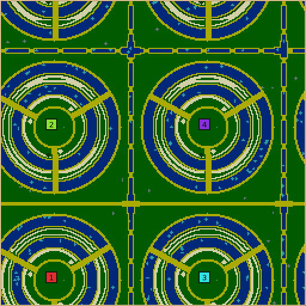
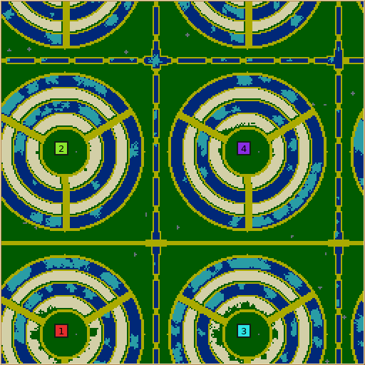

# Rice Terraces: initial AI playtest and tuning

Generator revision **4**, September 15, 2026. [The subsequent bulk generation repair](BULK_GENERATION.md)
is revision 5; these AI games were run before that constrained crop rescue was added.
The final opening completed 12 games
(48 colonies) without an elimination before tick 10,000. This is an initial AI
playtest, not a claim of human balance or freedom from later starvation.

## What changed

- Each summit starts with a completed small inn containing ten wheat. This finite
  first meal bridges the race to construct and supply an inn; subsequent meals
  still depend on farming and deliveries. No fruit is supplied.
- Starting towers have both loaded magazines and full finite stone reserves.
  Previously, three towers recruited three of the four opening workers to fetch
  stone even though their magazines were already full.
- Starter wheat is placed beside every inner stair mouth. The wood guarantee
  remains beside the first stair. Crops remain outside the dry summit containment.
- Three stairs remain the default. A four-stair comparison did not establish a
  consistent reason to change the number of fronts.

The shared `placeStartingBuilding`, `plantPatchNear` and optional tower reserve
operation implement these policies. Comments explain footprint search, selective
supplies, service-list registration, proximity heuristics and finite guarantees.
Existing generators retain their previous output; no AI or simulation rules changed.

## Study design

All games used four colonies on 256×256 maps, homogeneous Nicowar, Cortex or Maxima
mirrors, native team-timeline telemetry, replays and periodic saves. Logical jobs
are the samples; telemetry rows and transport attempts are not extra games.

| Cohort | Revision / change | Map seeds | Game seed | Games | Tick cap |
| --- | --- | --- | --- | ---: | ---: |
| Baseline | 1, original opening | 7, 41 | 19 | 6 | 90,000 |
| Four stairs | 1, four stairs | 7, 41 | 19 | 6 | 90,000 |
| Reserve | 2, tower reserves | 7, 41 | 19 | 6 | 90,000 |
| Entrances | 3, wheat at each stair | 7, 41 | 19 | 6 | 90,000 |
| Earlier validation | paired revisions 1 and 3 | 20011, 20012 | 23 | 12 | 60,000 |
| Final opening | 4, starter inn | 7, 41, 20021, 20022 | 19 / 31 | 12 | 60,000 |

Training used seeds 7 and 41. Revision 3 failed validation, so revision 4 was
checked on fresh seeds 20021 and 20022 as well as the training pair. An opening
loss means elimination before tick 10,000: this threshold was chosen after the
baseline diagnosis and before validation. It measures the first-meal failure,
not eventual victory.

Cortex lost two of eight training colonies in the baseline, two with reserves
alone, and one with nearby food. Revision 3 still lost two colonies on validation
seed 20012. The final revision lost **zero of 16 Cortex colonies**, and **zero of
48 colonies across the three AIs**, during the opening.

The engine can continue simulating an eliminated colony after its AI stops
polling. The analysis therefore stops its economic counters at elimination;
later autonomous births are not counted as recovery. Snapshot metrics use the
last telemetry sample at or before the requested tick. Completed-building counts
exclude the prebuilt inn. Whole-game starvation ratios have different observation
horizons across cohorts and should not be compared as a treatment effect.

### Matched training-seed observations

Values below sum the four colonies and stop each eliminated colony at its final
active sample. The first two columns compare the same game seed and map seed.

| AI / map seed | Wheat harvested by ~10k, baseline → final | New buildings by ~30k, baseline → final |
| --- | ---: | ---: |
| Nicowar / 7 | 263 → 817 | 61 → 61 |
| Nicowar / 41 | 316 → 730 | 67 → 66 |
| Cortex / 7 | 98 → 132 | 17 → 31 |
| Cortex / 41 | 122 → 132 | 27 → 26 |
| Maxima / 7 | 135 → 255 | 33 → 39 |
| Maxima / 41 | 156 → 303 | 36 → 47 |

These are descriptive samples, not a statistical balance guarantee.

## Later play and remaining limits

Nicowar and Maxima reached ground combat. In the final revision, Nicowar's first
recorded melee damage occurred at tick 13,312 on seed 7 and 14,336 on seed 41.
Fresh seed 20021 produced a decisive Nicowar game ending at tick 53,538.
Cortex remained much slower to attack, with no recorded melee damage by 60,000
in these final games. Later food shortages still occurred. Longer mixed-AI and
human games are needed to judge tower strength, stair closure choices, swimming,
and whether the valley fruit is sufficiently attractive.

## Validation and artifacts

[Download the review packet](playtest.zip): accepted requests/results, compressed
native gameplay measurement extracts, analysis scripts and summaries, selected
full saves/replays, runtime source snapshots with recorded hashes, native map,
request report, previews and verification logs. Extracts explicitly identify their
source stdout artifact; they omit unrelated performance and AI polling output.
The original full tournament artifacts remain under `artifacts/rice-playtest` on
the study coordinators. The [original revision-1 evidence](README.md) is unchanged.

- Linux and macOS: defaults/toolkit contracts and 12,000-call growth regression passed.
- Both platforms: 256 golden rows compared, zero failures. All pre-existing
  generator rows are unchanged; all eight new Rice Terraces rows agree.
- Same-basename native seed-7 map SHA-256 on both platforms:
  `924a225bb24df4ee3a3b44e1b2382dd681a75d5dd1964b70ca83355c4eae0f00`.
- Final size/team sweep: 36 generated maps, zero failing supported combinations.
  128²/four colonies and 256²/twelve colonies remain deliberately unsupported.
- Final crowding/scarcity study: eight valid requests and four expected geometric
  rejections. The earlier broader telemetry studies are retained separately.
- Telemetry equivalence: 96 generated cases, zero semantic failures with collection
  enabled versus disabled. Aggregate timings were 27,096.806 ms off and 26,992.003 ms
  on; these are noisy host measurements, not a speedup claim.

Generation/map-byte agreement does not establish per-tick simulation agreement.
Games ran on Linux; Windows and cross-platform per-tick replay comparisons were
not performed. No save-format or network-version change was introduced.

## Reproduce

Runtime snapshots are overlays against Git base
`c8a24ba3e01a4005604247cb19ba168504055d60`. Every recorded `src/` and `data/` file
in each of the four snapshots was checked against its immutable bundle's source
identity. The packet includes experiment manifests and the scripts used to submit
them through `python3 -m tools.tournaments`.

After extracting the packet, from that source checkout:

```sh
PYTHONPATH=. python3 scripts/review-analysis.py review
python3 scripts/compare.py review
scons release=1 server=0 -j6 map-generator-defaults-test map-generator-golden-test build/src/glob2
build/src/glob2 --generate-map rice-terraces --seed 7 --width 256 --height 256 --teams 4 --output inn-7.map --preview inn-7.png --json inn-7.json
```

Hosts used: `therig.local` and `pharaoh-dev-{1,2,3}.local`; `devlaptop.local` was
occupied. SSH host verification was preserved. One comparison save had a corrupt
compressed spool object; its retained native save matched its recorded raw hash.
The verified native save was recompressed on two hosts with matching output, and
only its transport hash/size metadata was repaired. The original record and corrupt
object were preserved on the worker. No game was rerun or gameplay result edited;
recovery metadata is included in the packet separately from gameplay outcomes.

### Final revision, initial terrain



### Final revision, after 60,000 ticks of Nicowar


