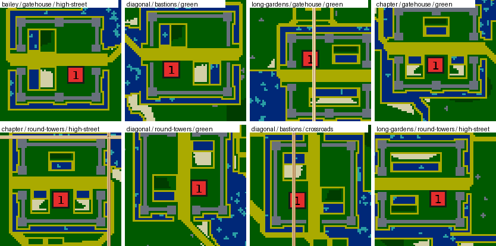

# Forts

**Forts** (`forts`, numeric ID 35) is a medieval, central-European-inspired landscape:
stone enclosures open onto wooded uplands, rocky crowns, winding river valleys,
irregular lakes, market-town sites, fields and orchards. It is an imagined countryside, not a geographic
reconstruction of Europe.

Each colony starts in a rectangular fort with two opposite gates, a broad construction
courtyard, separate irrigated wheat and wood plots, and a small household orchard. A
shallow moat runs all the way round each fort, broken only where the gate roads cross it,
and narrows round any tower that stands out past the wall (a beach may not touch stone).

Every fort on a map is built to one design, so the colonies start alike, and the design
changes from map to map. The design combines:

| Part | Choices |
| --- | --- |
| Interior layout | **Bailey** (yard on one side, wheat and wood plots side by side on the other); **diagonal** (wheat and wood in opposite corners, yard in the other two); **long gardens** (a long wheat garden down most of one wall, wood along half the opposite wall); **chapter** (wheat in the two corners of one wall, wood in the middle of the other) |
| Walls | **Bastions** (square corner bastions); **gatehouse** (bastions, a square tower either side of each gate and one in the middle of each long wall); **round towers** (at the corners and beside the gates) |
| Orientation | Gates east–west or north–south, and the layout mirrored across either axis |
| Market towns | **Crossroads** (four plots); **green** (a ring street round a small green, cut by one through street); **high street** (a main street with a back lane crossing it either side), turned either way |

Plots and towers stay a tile clear of the ramparts. A tile of stone needs all four of its
corners grass, and a mirrored plot's sand sits one corner nearer the wall than the original,
so this margin makes every turn and mirror legal. A plot watered along its long side takes
its water on the side toward the gate road. The engine does not count water that has pure
sand directly opposite it, so crops between a canal and the broad road never regrew.
Sand borders contain those plots; sand roads through the gates resist crop growth
and connect the colonies by land, crossing rivers at fords. The opening supports
settlement inside the fort; larger economies and additional fruit collection encourage expansion
into the countryside. Swimming adds river crossings but does not bypass stone walls.

Ramparts are permanent stone **resource deposits**, not owned buildings. They also
provide quarry access and cannot be demolished. Towers are built by the players;
none are granted at generation. Sand gate roads cannot carry buildings, so defense
comes from the flanks rather than sealing the road with a building. This favors
fortified openings with two approaches rather than fully closed castles.

A broad Rhine-like river bends around the forts, with irregular lake basins and
tributaries. Roads favor valleys, reuse junctions and cross water at fords. Wooded
uplands and rocky crowns separate approaches. Market-town sites favor nearby ground on each fort’s side of the countryside,
with four protected building plots, crossroads and nearby fruit where space permits. They are reserved
before the river is routed, so water bends around them. Both gate destinations are
chosen together to limit total travel distance to distinct road hubs. These
are places for players to develop inns and outposts, not prebuilt neutral buildings.
The intended choice is whether to secure crossings and orchards early or consolidate
the fort first. Town sites may be omitted when a crowded map cannot fit them.

## Controls and limits

| Control | Default | Range and meaning |
| --- | --- | --- |
| Home size | 22 | 20–26, step 2; fort half-width in tiles, excluding projecting bastions |
| Gate width | 6 | 4–8, step 2; pure-sand core width, with walkable margins beside it |
| River width | 9 | 3–13, step 2; nominal water-corner width, locally narrowed between forts and interrupted by fords |
| Lakes | 1 | 0–3 requested basins per fort; each targets roughly map area / (16 × colonies) water corners |
| Village size | 10 | 8–12, step 2; half-width of the market-town sites |
| Resource amounts | 100% | 0–300%, step 25; wheat, wood, stone, algae and fruit |

Every home retains at least 32 wheat and 32 wood tiles at zero abundance. Surplus
planting scales with the crop sliders and caps at the contained plots' capacity.
Each household orchard has three tiles of each fruit at 100%, scaling to zero or
nine at the slider extremes. Structural fort stone remains at zero stone abundance; rocky uplands and scattered
quarries scale. Ambient resources stay off the reserved roads and home buffer.

Shared sizes are 64, 128, 256 and 512 tiles on either axis, with 1–12 colonies and
1–8 starting workers. The actual envelope depends on spacing: each pair of lattice
sites must differ by at least `2 * home-size + 16` in one wrapped coordinate, and
the shorter map side must also meet that minimum. Unsupported combinations are
rejected explicitly. Examples at defaults: 64×64 supports one colony, 128×128
supports four, and 256×256 supports twelve. Odd counts and rectangles are supported
when the same spacing test passes. Increasing fort size can invalidate a crowded map.

Sites are dealt randomly to colony indices. Homes share a construction and crop
budget; surrounding terrain and routes are asymmetric. This is not an exact-symmetry
or competitive-balance guarantee. The map wraps: forts can cross the preview edge.
The smallest maps devote much of their area to forts; 256×256 gives the countryside
more prominence.

## Implementation and validation

`FortsGenerator.cpp` reconstructs its layout for validation. It uses shared lattice
sites, periodic noise, sand/beach sketches, cheapest walking routes, settlements,
fertility fields, planting, wall isolation and building-footprint helpers. No shared
primitive or simulation behavior changes. Existing save/replay/network formats and
generator IDs remain unchanged.

Finished-world checks require every designed wall deposit, resource-free roads,
no entrance outside the two gateways (with gates shut), at least 64 clear 4×4
building anchors inside each fort, walking connectivity between colonies, and at least 16 clear 4×4 anchors per
placed market town.
These anchors overlap; they are not a count of independent buildings.

Telemetry records the design (`forts.design.layout`, `.walls`, `.town`, `.gates`), fort dimensions/counts, river orientation and fitted width, lake target/actual area and capacity limits,
town placement/omissions, plot target/actual
planting and summed growth potential, household orchard counts, plot-capacity limits, forest tiles and rocky-upland tiles, alongside shared
settlement and starting-resource observations. It makes no random draws or extra
map scans for collection.

## Verification

The source definition and its request/world validators define accepted settings and
finished-map guarantees. Run the focused `MapGeneratorDefaults` contracts and the
platform golden rows, inspect small/large rectangles and resource extremes, then
check populated games with complete seat rotations. See [generator verification](verification.md)
for commands, revisions, save/replay checks and evidence requirements.

## Implementation source

[FortsGenerator.cpp](../../src/map/generator/generators/FortsGenerator.cpp) owns this landscape's construction, controls and validation.
See the [catalog](catalog.md) for its stable command and legacy IDs.

Related: [map generators](README.md).
