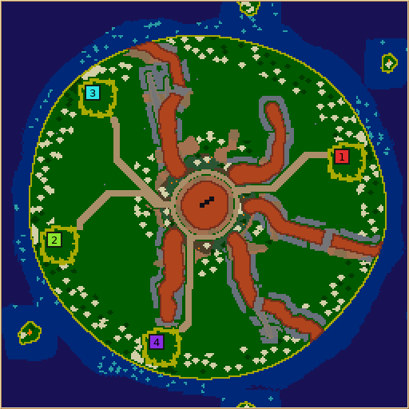
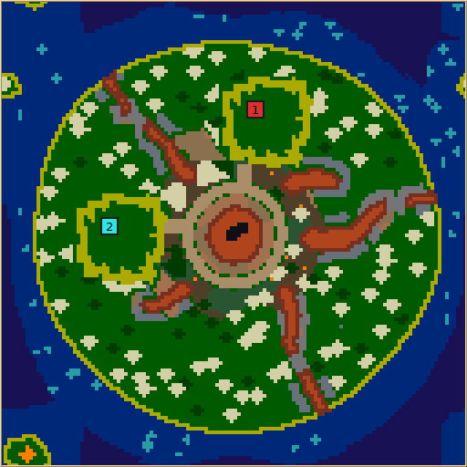
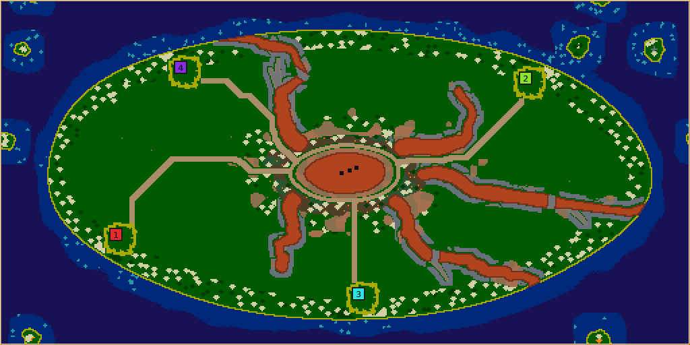
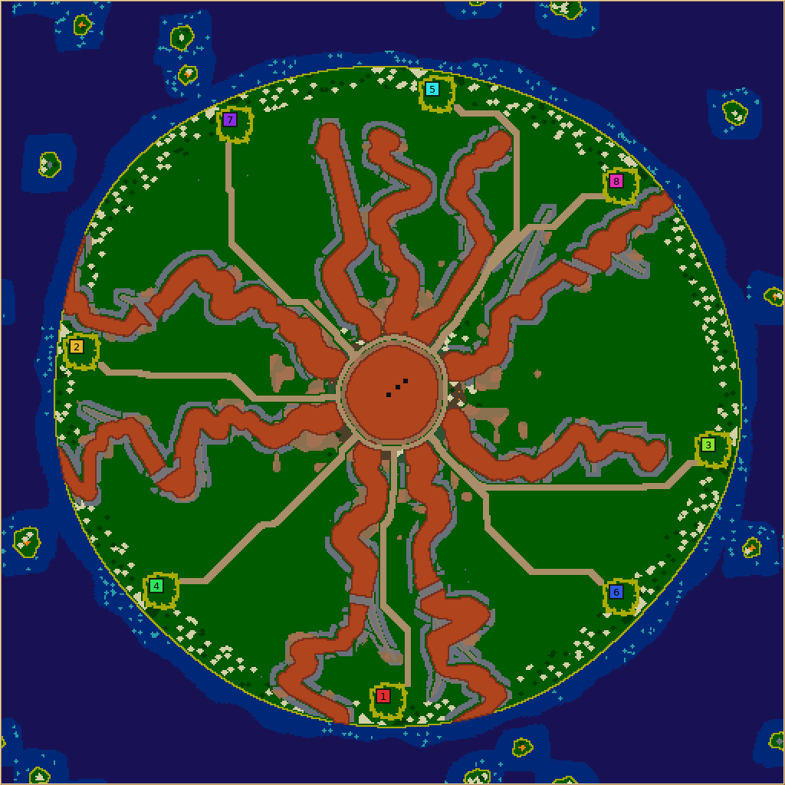
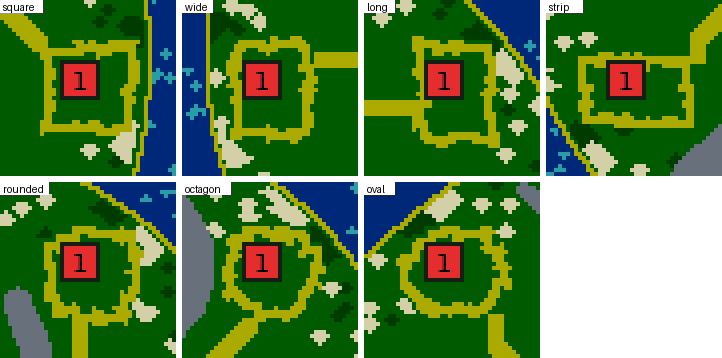

# Lava shield

## On this page

- [Play contract](#play-contract)
- [Construction and validation](#construction-and-validation)
- [Evidence policy](#evidence-policy)
- [Implemented interpretation](#implemented-interpretation)
- [Playtest limitations](#playtest-limitations)
- [Verification](#verification)
- [Implementation source](#implementation-source)

## Play contract

Lava shield is an asymmetric volcanic island: a lava lake in the crater, live lava
tongues running downhill, older cooled flows branching off them, and unequal green
wedges between them. Deep ocean surrounds the island across the toroidal map seams.
Colonies occupy scored usable ground, not repeated angular slots. There is no inland
water; the coast and the volcanic loam of the crater rim support renewable
production, while middle slopes supply relatively dry construction and expansion
ground.

The opening should establish food, wood, population and training within a roomy
home clearing. First contact is a choice between neighbouring coastal approaches
and the exposed crater rim. The rim offers renewable farmland and fruit, with room
for feeding infrastructure. Swimming changes coastal approach costs; nothing crosses
lava on foot. The stone crust along the flows is an inexhaustible quarry, so
ammunition scarcity is deliberately not this map's pressure.

### Lava walls and fords

The tongues are terrain of the
catalogue's lava group: lava with an ember fringe, impassable on foot and harmful to
fliers, which route around it. Lava is not water, so a long tongue runs into the sea
with no beach and seals its two wedges from each other along the coast. Each long
tongue therefore keeps one **ford**: the flow is cut across its whole width for about
five tiles at a point 40–65% of the way down and filled with scree, slow but
walkable. Short tongues stop inland and leave a broad coastal gap, as before. The
crater is a lava lake with one to three void vents, ash between the lake and the rim
circuit, and loam and moss on the rim. All colonies still meet on foot, over the rim,
the fords and the short tongues' gaps; swimming adds coastal approaches. No colony
requires swimming to survive or meet rivals.

## Construction and validation

Reserve the crater, its walking rim, and the ocean before drawing the flows. Use
independently sized angular intervals and downhill walks with correlated turns;
never rotate one completed branch tree into colony copies. Collision checks stop
side branches before they erase usable wedges. Report requested and surviving
branches, refused growth and effective coastal variants.

Select homes by usable footprints, fertility, accessible supplies and separation.
Randomly deal selected sites to teams. Judge completed settlements with
`StartQuality`, retaining absolute resource-access and room floors; equal scores
alone do not prove equal expansion, contact costs or winning chances.

Keep starter guarantees distinct from ambient abundance. Scale every optional
resource layer, including rim fruit, with its control. The crust stone along the
flows stays at zero stone abundance. Road reservations must preserve travel and
construction through future crop growth without adding home ponds.

Validation must inspect final terrain and resources: the ocean and every lava wall
survive, the reserved rim stays open, every ford is open ground the colonies reach,
homes have room and both primary resources, and colonies reach the rim. Reject
infeasible settings or failed essential geometry with a stage-specific explanation;
do not quietly carve through lava or add inland ponds as a repair.

## Evidence policy

Support limits and numeric tuning are recorded below. Seed sweeps, held-out seeds,
preview comparisons, resource extremes and actual AI expansion inform the defaults.
Generation repeatability, static viability, AI performance and human enjoyment are
separate claims. Missing platform and human-play coverage remains explicit.
Keep run-specific evidence in ignored `artifacts/` and accessible pull-request attachments.

### Review previews

These committed previews are native generator screenshots of revision 5. They show
the lava crater, unequal green wedges, live tongues with their scree fords, cooled
grey branches, the crust and ash along the flows, dirt-track approaches, scored
coastal towns and the deep-water ring at four useful scales. Resource sprites appear
as small light marks.

| Default 256² | Minimum 128² |
| --- | --- |
|  |  |

| 512×256 rectangle | Denser 512² layout |
| --- | --- |
|  |  |

## Implemented interpretation

Short tongues leave broad green coastal gaps; long tongues seal the coast and are
crossed at their fords. All colonies can meet on foot. Swimming adds ocean approaches
and may shorten travel; it is not a prerequisite for crossing a seal. The generator
uses only existing catalogue terrain and does not alter resource or movement rules;
a generated map carries the lava, paths, barren, rough, fertile, deep-water and void
terrain experiments in its header.

### Controls and support envelope

| Control | Values; default | Player consequence |
| --- | --- | --- |
| Lava tongues | 3–9; 5 | More lava walls divide the slopes into more, smaller wedges. Independent of colony count. |
| Long tongues | 25%, 50%, 75%; 50% | Percentage of primary flows reaching the coast. Rounded to a count, with at least one long and one short flow. Changes broad coastal gaps versus sealed coasts crossed at a ford. |
| Branching | 0–3; 2 | Side-branch proposals per primary flow. Crowded or uphill proposals are omitted, with counts in telemetry. |
| Crater rim width | 6–12, step 2; 8 | Loam budget outside the fixed circuit margin, before the lava roots begin. |
| Islets | on/off; on | A couple of small islands out in the ocean where the torus wraps (at least two, one more per 8,000 tiles of sea), each six tiles of water from any coast so only swimmers reach it, each with a prize at its middle. Disabling this control leaves the ocean empty. |
| Wheat/wood amounts | Shared percentage controls | Scale optional fertile patches; external starter patches remain guaranteed. |
| Stone amount | Shared percentage control | Scales sparse optional outcrops. The crust along the flows remains an inexhaustible quarry at zero. |
| Algae amount | Shared percentage control | Scales shallow-water clumps, using the engine-derived growth preference. |
| Fruit amount | Shared percentage control | Scales sparse rim prizes. Zero removes this reward; the fertile rim remains. |

Supported sides are 128–512 tiles, with aspect ratio at most 2:1.
The shorter side limits colonies to 2 at 128, 8 at 256, and 12 at 512.
On a 128-tile short side, or with more than four colonies on a 256-tile short
side, use at most five tongues and rim width eight. The highest-density combined
controls failed town/approach budgets in the first held-out study; this conservative
restriction keeps the tested default geometry budget at those densities. Larger
or less crowded worlds retain the full controls. These are explicit geometric
bounds, not a claim that every accepted seed succeeds.
The shared worker control supports 1–8 workers. The settlement operation itself
requires each worker to touch the swarm, whose adjacent ring has twenty cells.
Invalid dimensions/counts are rejected before mutating a world.

### Geometry constants and why they exist

All distances below are tiles unless stated otherwise. They are design heuristics,
not engine constants; the actual four-corner terrain rules and growth predicates
remain authoritative.

| Budget | Meaning and rationale |
| --- | --- |
| Island radius `0.43 × shorter side`, roughness `0.06` | A gently irregular island with ocean left across every toroidal seam, including at maximum positive coastline wobble. Stretch changes centres to fill rectangles; flow thickness stays in map tiles. |
| Crater radius `max(8, 0.06 × shorter side)`, roughness `0.08` | A visible lava lake at minimum size without consuming the whole slope. Corners touching anything but lava are ember; 1–3 void vents of radius 1.5 sit within 45% of the radius. No starter ponds are added. |
| Crater circuit at local lake radius + 5, half-width 1.5 corners | A continuous dirt-track route round the crater; inside it, two corners clear of the track, the crater wall is dirt and clay; outside it, out to the lava roots ±4 tiles by noise, the rim is loam with moss patches. The circuit uses approximately one sample per circumference tile. |
| Lava roots at lake radius + rim width + 5 | Separates the useful rim budget from the fixed circuit cost. Thick root lobes form a broken crown of lava; the openings admit approaches. |
| Angular interval weights `0.65 + U[0,1)` | Unequal green wedge sizes with a lower bound. The weights normalize to a full turn; no complete branch is copied into another sector. |
| Primary steps 3; angular memory 0.72; angular noise 0.055 radians | Bends persist over several steps instead of alternating in a noisy zigzag. Heading stays within 30% of the smaller adjacent angular interval. Radius always increases. |
| Width `clamp(shorter/70, 2, 5)`, roots ×1.8 | Thick roots taper to legible, raster-safe fingers. Width does not grow without bound on large maps. The flows are drawn on corners half a tile thinner than this, because a tile takes lava from any corner; this preserves the intended wall footprint. |
| Ford: 2.5 tiles either side, along the flow, of a point 40–65% down each long tongue | A crossing about five tiles long through the whole width of the flow, filled with scree (slow, unbuildable, walkable). No crust stone within four corners of a ford. |
| Flow girth: ±25% over 18-tile noise; primary toes ×1.35 over the last three points; corner strokes at least 1.25 | Flows swell, narrow and spread at their toes instead of reading as constant-width tubes; the thinnest stretch is still a wall two pure tiles across. |
| Margins along the flows: 12-tile noise cells; crust below 0.62, bare to 0.70, scree to 0.85, ash above; reaches 3, 3 and 4 corners at 256-tile sides, halved at 128 | Stretches of stone crust on the grass, bare grass up to the flow, scree aprons and dirt or clay ash, measured from live lava and cooled branches alike. Laid after the towns, their rings and roads, which they never touch. The crust provides accessible stone while retaining breaks and varied ground along the flows. |
| Upper-slope ash: from the lava roots a third of the way to the coast, where a 9-tile noise exceeds a threshold rising from 0.45 to 1 | Dirt and clay patches that thin out downhill give the cone a slope. Laid with the margins, after the towns. |
| Deep water about 10 steps from any land, ±4 by 20-tile noise | The far sea reads dark and swims slowly; algae stay in the shallow band; no island or islet sits in a ruled ring of shallows. |
| Short-flow setback 12–22 × `sqrt(shorter/128)` | Broad coastal detours remain useful as size grows. A conservative minimum coastline radius protects the gap against a later bend. Long flows end beyond the maximum coastline radius. |
| Fork origins 25–75% along parents | Branches emerge along the slope, leaving roots readable and avoiding coast-tip stubs. |
| Fork lengths 35–60% of remaining radial extent; angles 0.35–0.65 radians; bend ±0.1 | Side growth makes asymmetric fingers without routinely reversing uphill. Half-width starts at 75% of the parent's and ends at 2. |
| Branch clearance 6; coastal clearance 8 | Optional branches must leave land between unrelated flows and keep the primary flow's coast/gap role. All primaries exist before forks compete. Paths belonging to the same primary (parent and siblings) are exempt and may merge into a lobe. An explicit radial check rejects uphill bends; `1e-6` only tolerates floating-point reconstruction at the shared root. |

### Town selection, crops and room

Every town on a map is drawn to one plan. The plan is one of seven shapes, each
about 250 clear tiles: a 16×16 square, rectangles of 18×14, 19×13 and 22×11, a 17×17
square with rounded corners, a 17×17 octagon and a 20×16 oval, turned either way. Its
edge frays. Round the town, stretches of the boundary sit a corner inside or outside the
plan, and here and there the two-corner sand ring runs a corner thicker. The fray is drawn
once, from the `lava-town` stream, and every town shares it, so the colonies start on the
same ground and the edge still looks grown rather than ruled.

Candidates lie on a four-tile sampling grid. Every tile the town will touch (its grass and
every tile with a corner in its ring, thicker stretches included) must be pure grass or
the rim's loam, which the town turns back to grass so no crop takes root inside it, and
so the ring can never take a corner from a tile of lava. Each candidate must also be 12–21 eight-neighbour grid
steps from ocean water (crater sources are excluded). A radial exclusion keeps crater-side candidates out so the
summit starts neutral. Fertility is summed over a square three tiles past the plan's
half-length (23×23 for the square town): the town and its immediate external growing edges.

Each proposal starts in the fertile half of candidates, then uses shared weighted
maximin spreading. The preference multiplier spans 0.6–1.0, keeping spacing relevant
when fertility differs. A Euclidean separation of two town envelopes plus eight tiles
(28 for the square town) is an absolute floor; it follows the plan's size, not its frayed edge. Sites
are dealt to team indices before placement. Four proposals are fully materialized;
`StartQuality` scores actual swarms, workers, harvest trips, resources and room.
A proposal must have wheat within 24 steps, wood within 32, at least 48 reachable
4×4 building origins, and a map fairness of at least 0.80. Origins overlap;
48 does not mean 48 separate buildings. The winning proposal maximizes the shared
map score, the [fitted fairness model](fairness-model.md)'s estimate of how evenly
the towns share the chance of winning. Its 0.80 floor is a model-scale criterion,
not a ratio of weakest to strongest raw town quality. Ties keep the earlier proposal.

Each town leaves its plan's pure grass inside the frayed two-corner sand ring. An
approach begins two corners beyond the plain ring and reaches the crater circuit,
protecting town and route from future crop growth; it is reserved as sand and then
laid as dirt track, except beside water, where it stays a sand beach. It first requests three tiles
of width. If that cannot fit, the same shared operation tries a one-tile route with the
same protected terrain and routing costs. Existing walkable non-grass beach
tiles are reused unchanged; only new stretches are painted pure sand. This explicit narrow-detour
fallback can be congested; static economic scoring does not measure convoy throughput. No guaranteed
crop may end up inside the town after repair. These reservations consume buildable
land deliberately; they make the remaining building space durable.

Starter wheat aims for 40 tiles, starter wood for 32. Their seeds maximize positive
engine fertility within a box eight tiles past the plan's half-length (16 for the square
town); growth stays within ten tiles past it (18) and
outside all reservations. At least half each target must fit or the proposal fails.
This shortfall tolerance preserves usable harvest edges without moving water or
rock. Final walking access is checked separately; straight-line distance is not
accepted as a substitute.

The single highest-fertility seed can lie on an isolated grass island beside stone
or sand. A field below its acceptance floor makes up to three bounded secondary
patch attempts. `seedForPatchCapacity` ranks legal clear ground by the number of
eligible tiles in its 5×5 neighbourhood, then fertility. This local density probe
costs work only after a shortfall, and avoids a full map-component search for
every team. Each retry has the same 16-tile seed and 18-tile growth reach, cannot
overwrite prior crops, and stops as soon as half the target exists. The generator
still rejects a town without sufficient renewable starter frontage. Sufficient
first fields use the original path. A whole map can still change when one of its
previously rejected settlement proposals becomes viable and scores above the old
choice; the paired bulk report counts these changes rather than assuming that
every formerly successful seed is byte-identical.

Ambient seed cells are seven tiles apart with independent jitter. Two thirds of
patch proposals are wheat (12 tiles at 100%), one third wood (8 tiles); counts scale
with the appropriate amount. Patches use positive-fertility grass, stop within an
eight-tile Chebyshev radius, and cannot occupy reservations. Large percentages can
saturate eligible space; proportional final tile counts are not promised.

Prizes sample jittered five-tile cells. On the rim, base fruit probability is
450/1000, scaled by fruit amount; each deposit draws one of the three fruit types.
Outside the rim, optional stone probability is 30/10000, scaled independently.
These sparse deposits leave circulation and outpost room. Algae uses one clump per
100 eligible shallow tiles at 100%, 1–12 steps offshore, preferring the best-growing
half of that band. The shared algae helper evaluates its own engine growth rule.

### Fallbacks, errors and final checks

- A side branch that collides, approaches the coast, or travels uphill is omitted.
  No partial clipping or extra retry silently fills its missing shape. Telemetry
  records requested, placed and refused branches.
- A site search can return an incomplete proposal. It does not shrink towns, cut
  rock, change water, or relax the separation floor.
- Approaches first reserve three tiles of width, then one if necessary. The wide
  failure leaves the terrain untouched. The narrow fallback changes no water or
  rock and keeps crop growth off the path; telemetry records its use and actual width.
  The caller identifies existing passages using native walkability and `!isGrass`,
  so mixed beach tiles need no illegal pure-sand conversion.
- Full proposals fail on missing town/worker room, absent fertile starter fields,
  starter patches below their floor, missing protected approaches, or quality floors.
  Scored selection records each failure and returns an actionable reason if none fit.
- Shared crop guarantees run with the crust stone protected. A final crop-clearing
  route may remove crops, but fruit, stone, lava and water stay blocked. The reserved
  approach should make that operation a no-op in ordinary cases.
- Final validation reconstructs terrain from the request, checks the ocean, every
  wall tile of lava, the entire reserved crater circuit, actual worker connectivity
  to every colony and every part of the circuit, and that every ford has open ground
  the colonies reach. A failed map is discarded by the generation service.

### Reusable operations

`Drawing::downhillPath` is a deterministic, tapered radial random walk. It rejects
invalid/nonfinite geometry before drawing RNG, includes the exact end radius, and
bounds pathological requests to 65,536 segments. `Points::spreadRankedSites` supplies
weighted maximin proposals with toroidal spacing, stable ties and explicit partial
failure; it normalizes finite weights before multiplying distances to avoid overflow.
Neither operation assumes a volcano or a team count.

`Roads::reserveSandRoute` reserves a cardinal or eight-neighbour route of chosen
width in a terrain sketch. It protects every water corner and every tile the caller marks, including
corner-conversion margins. Failure leaves the sketch untouched. It cannot create
a ford. Radius 0 gives one pure-sand tile across; radius 1 gives three.
At radius zero, an optional existing-passage mask permits reusing caller-proven
walkable, crop-proof tiles without painting them. These tiles may sit beside
protected terrain but cannot themselves be protected. A nonzero radius with that
mask is rejected: narrow existing terrain cannot certify a broad road. This
operation is useful for mixed beaches and existing paths, independently of lava.
The caller supplies the semantic mask; the helper validates its dimensions and
still protects every corner it actually changes.
Optional positive tile costs guide Dijkstra routing. Eight-neighbour travel uses
10/14 cardinal/diagonal step lengths; cardinal-only mode keeps unit lengths. Costs
are bounded by `INT_MAX / tileCount / maximumStepCost`, avoiding path-sum overflow.
Malformed masks, negative radius or invalid costs fail atomically.

Lava shield supplies a smooth periodic noise field with 24-tile cells and costs
100–399. This roughly fourfold preference makes approaches bend around favoured
ground without encouraging huge detours. Eight-neighbour routing avoids the long
right-angle elbows observed in the first cardinal-only previews. The three-tile
width still reserves every affected terrain corner, including at diagonal turns.
The maximum supplied cost 399 also stays below the helper’s safe 585 bound at
512×512 with fourteen-unit diagonal steps.

`ScoredSettlements::chooseScoredSettlements` evaluates caller-provided settlement
proposals in fresh worlds. It copies the caller's current named RNG streams and
reuses the same engine RNG state for every trial, restoring engine RNG even on an
exception. It returns the winning sites and measured quality; the caller builds
those sites using the same callback and unchanged RNG state. Rejected trials never
mutate the destination. The proposal list is the work budget. This is separate
from the legacy `BalancedStarts` placement model and changes no existing caller.

Regression coverage lives in the existing `MapGeneratorDefaults` toolkit
checks, already run by CI. It includes monotone radius and drift limits, terminal
width, repeatability, malformed input, seam-aware spacing, complete road width,
water/protected terrain preservation, atomic route failure, advanced named-stream
copying, engine RNG restoration on rejection and exceptions, and reconstruction of
a successfully scored proposal, and a protected corridor in which the atomic
three-tile attempt fails but a one-tile route fits, and an unchanged mixed beach
passage that cannot legally be repainted beside water and stone.

### Telemetry interpretation

Telemetry uses the shared bounded collector and stays disabled during disposable
settlement trials. The selected world's furnishing counters are therefore reported
once, rather than summing discarded proposals into the final map.

| Key family | Meaning |
| --- | --- |
| `lava-shield.tongues.requested`, `.long` | Primary count and effective rounded long-flow count. A long tongue seals the coast and is crossed at its ford. |
| `lava-shield.branches.requested`, `.placed`, `.refused` | Side proposals and collision/coast/uphill omissions. `branches.omitted` records the fallback when any are refused. |
| `lava-shield.crater.radius`, `lava-shield.rim.width` | Effective design-frame radius and selected rim budget in tiles. |
| `lava-shield.town.shape`, `.grass-corners`, `.half-extent` | The map's town plan, the grass corners one town holds after fraying, and half the plan's longer side. |
| `lava-shield.starts.candidates` | Terrain shortlist before complete-world trials. |
| `starts.scored.proposals`, `.viable`, `.selected` | Trial budget, number passing construction and quality floors, and zero-based chosen proposal (−1 on failure). |
| `starts.scored.outcome`, `.score` | Per-proposal outcome text and viable score; subject is the zero-based proposal index. |
| `lava-shield.approach.width`, `.narrow` | Width actually reserved (3 or 1), and an explicit fallback record when the one-tile attempt succeeds. |
| `lava-shield.approach.steps` | Centreline tile count per reserved approach; repeated records are separate homes. Diagonal steps are counted as tiles here, not Dijkstra cost. |
| `lava-shield.starter.wheat`, `.wood` | Actually planted guaranteed tiles per team; subject is the team index. Targets are 40/32, acceptance floors 20/16. |
| `lava-shield.starter.secondary` | Fallback occurrence when a starter crop needs another compact patch because the first seed had insufficient connected frontage. Successful first fields do not probe or change. |
| `lava-shield.ambient.wheat`, `.wood`, `.stone`, `lava-shield.prizes.fruit` | Actual optional tile placements, distinct from guarantees and the crust. |
| `lava-shield.lava.vertices`, `.fords`, `.vents` | Lava and ember corners in the live tongues (not the crater), long tongues given a ford, and void vents in the crater. |
| `lava-shield.crater.ash`, `lava-shield.ground.loam`, `.deep-water` | Corners of crater-wall ash, rim loam and moss, and deep sea. |
| `lava-shield.margin.crust`, `.scree`, `.ash` | Crust stone tiles, and scree and ash corners, laid along the flows after the towns. |

The generic algae helper supplies its existing counters. Counters reuse values
already computed by generation; they do not draw RNG or introduce analysis scans.
The bulk report joins them to final resource, room, movement and quality metrics.

## Playtest limitations

Economic start scores do not establish equal contact timing on this asymmetric map. Swimming changes coastal routes, and late food pressure and tactical enjoyment need populated games and human inspection. Earlier twelve-colony Nicowar crash findings predate the bounded enemy iterator now in the shared runtime; they are not a current controller limit.

## Verification

The source definition and its request/world validators define accepted settings and
finished-map guarantees. Run the focused `MapGeneratorDefaults` contracts and the
platform golden rows, inspect small/large rectangles and resource extremes, then
check populated games with complete seat rotations. See [generator verification](verification.md)
for commands, revisions, save/replay checks and evidence requirements.

## Implementation source

[LavaShieldGenerator.cpp](../../src/map/generator/generators/LavaShieldGenerator.cpp) owns this landscape's construction, controls and validation.
See the [catalog](catalog.md) for its stable command and legacy IDs.

Related: [map generators](README.md).
