# Modular generator validation

1,000 seeds per playable generator (20001–21000), 128×128, four colonies and four workers. Failed attempts are retained; tile percentages exclude failures. The baseline is the frozen tuned cohort from PR #238.

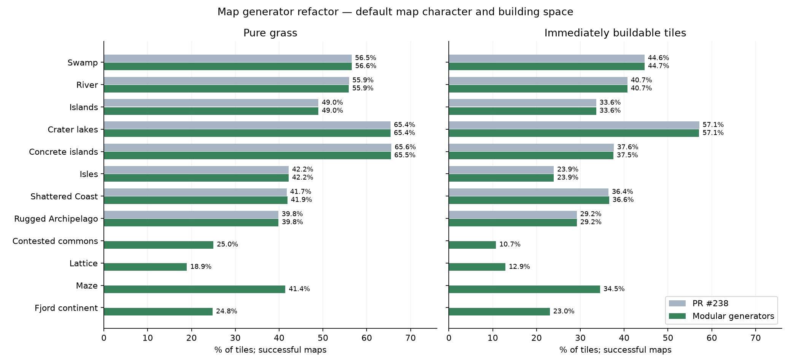

| Generator | Free tiles: #238 → refactor | Failures / 1,000 | All-team start proxy / 1,000 | Review flags |
|---|---:|---:|---:|---|
| Swamp | 44.64% → 44.65% | 0 → 1 | 952 → 940 | None |
| River | 40.74% → 40.72% | 18 → 20 | 800 → 780 | None |
| Islands | 33.60% → 33.60% | 0 → 0 | 985 → 986 | None |
| Crater lakes | 57.13% → 57.12% | 0 → 0 | 923 → 922 | None |
| Concrete islands | 37.62% → 37.53% | 8 → 5 | 981 → 982 | None |
| Isles | 23.95% → 23.93% | 0 → 0 | 1000 → 1000 | None |
| Shattered Coast | 36.42% → 36.57% | 14 → 26 | 823 → 799 | generation failures |
| Rugged Archipelago | 29.19% → 29.21% | 0 → 0 | 1000 → 1000 | None |
| Contested commons | — → 10.73% | — → 1 | — → 374 | New generator; no baseline |
| Lattice | — → 12.89% | — → 0 | — → 932 | New generator; no baseline |
| Maze | — → 34.49% | — → 0 | — → 999 | New generator; no baseline |
| Fjord continent | — → 23.03% | — → 0 | — → 995 | New generator; no baseline |

Review thresholds: absolute mean free-area shift >2 percentage points; failure-rate increase >1 point; all-team proxy decrease >3 points. Flags require investigation, not automatic retuning. The start proxy measures nearby building anchors and reachable wheat/wood; it is not a fairness guarantee.

[Investigation and visual assessment](REVIEW.md) · [Raw data](validation.csv.gz) · [Catalog](catalog.json)

## Map previews

Each row shows three fixed seeds and a weak successful start. Failed fixed seeds, if any, are labeled rather than replaced.

### Swamp

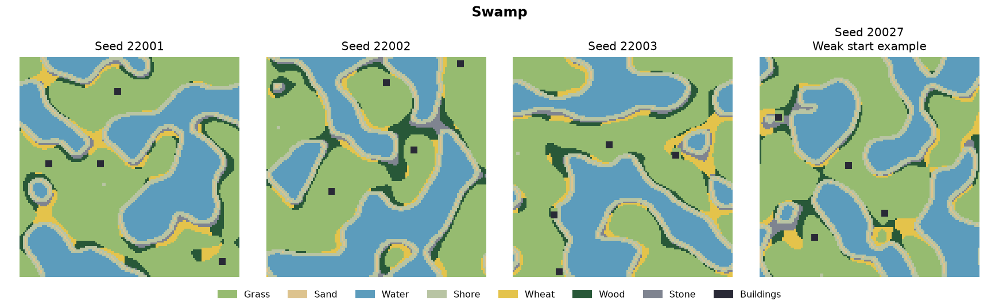

### River

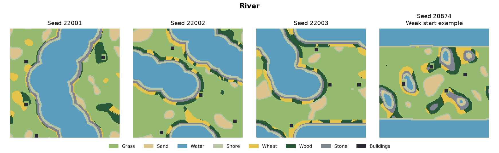

### Islands

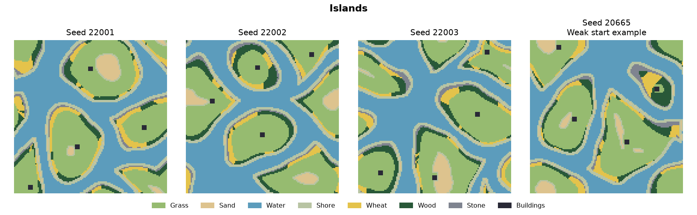

### Crater lakes

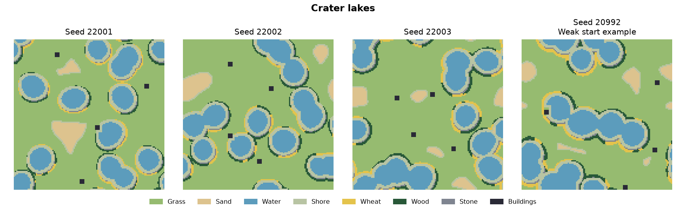

### Concrete islands

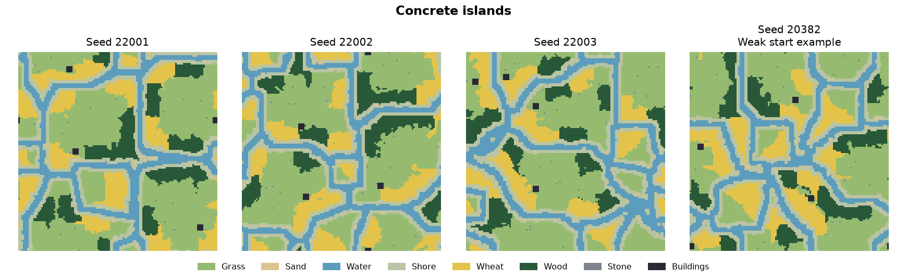

### Isles

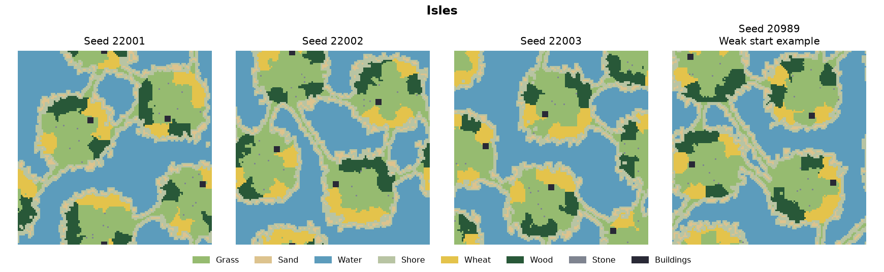

### Shattered Coast

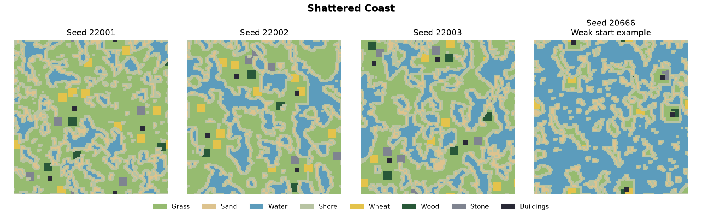

### Rugged Archipelago

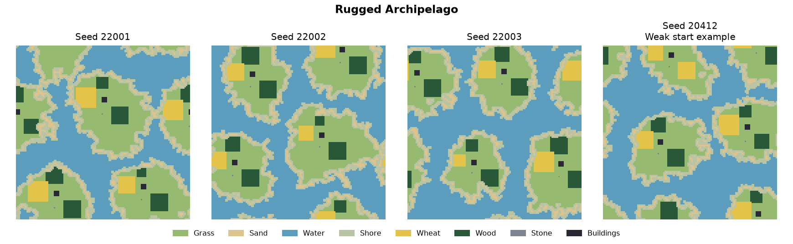

### Contested commons

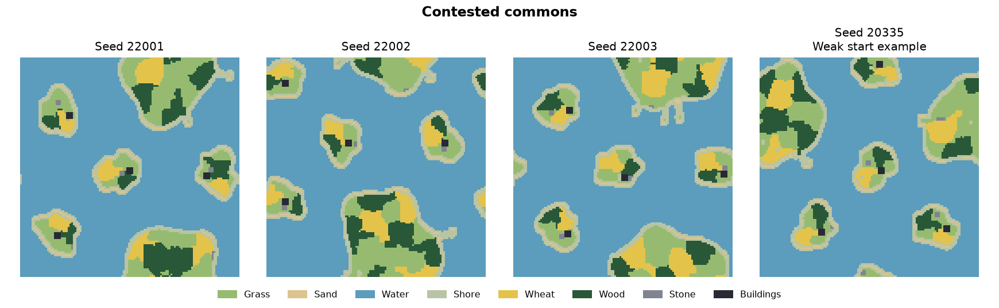

### Lattice

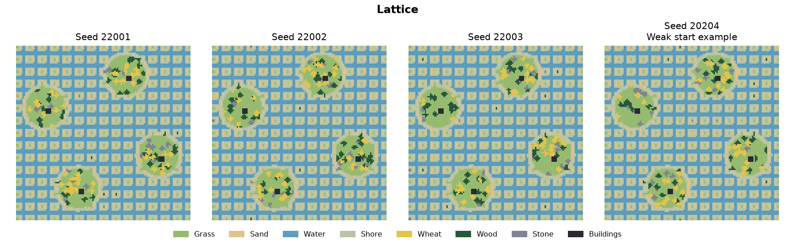

### Maze

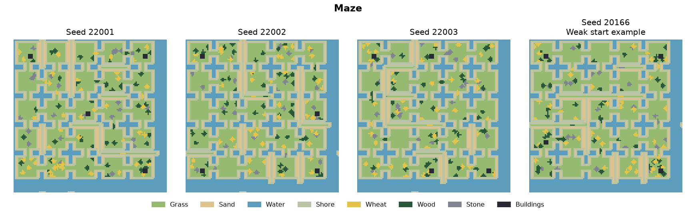

### Fjord continent

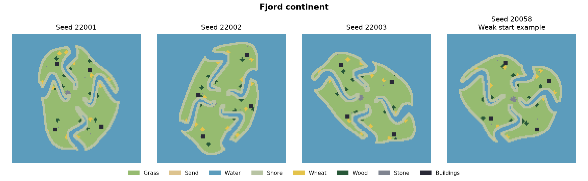
