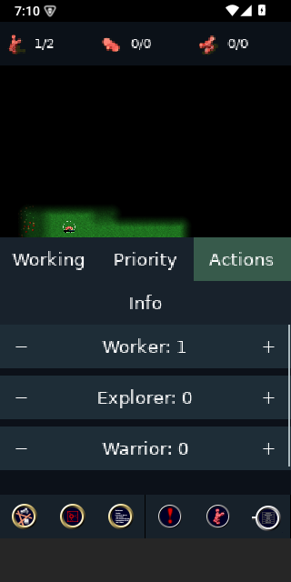
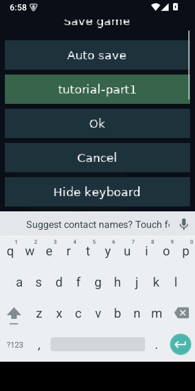
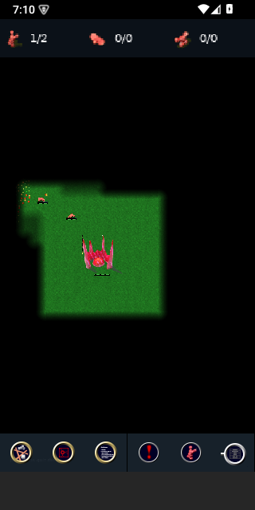

# First real-device preview

The first feedback device is a Pixel 6. This preview is for hands-on feedback,
not release qualification. Start with a
small single-player skirmish or tutorial. The simulation and file formats are
shared with desktop/browser; the phone HUD is selected after touch input.

## Android: install the preview

The refreshed preview includes phone settings/results, resumable replay saving,
and the native map/campaign authoring UI. `BUILD.json` records its exact source
commit; earlier preview notes in the verification history refer to older APKs.
Choose a terrain in Tools, switch the Pan map/Edit map control to Edit map,
then paint, open a scenario briefing, type, Hide keyboard, Cancel and rotate. Pan map mode should
move the view without editing terrain.

The prepared ARM64 APK is `build/mobile-preview/glob2-android-arm64-preview.apk`.
It targets Android 8/API 26 or later on an **ARM64** device. This particular APK
will not install on an ARMv7-only phone. No store account is required.

Copy the APK to the phone, open it, and allow installation from that file manager
when Android asks. Alternatively, enable USB debugging, connect the phone,
authorize this Mac on the phone, and from the mobile worktree run:

```sh
build/mobile-tools/android-sdk/platform-tools/adb devices -l
python3 mobile/android.py install --arch arm64-v8a --release --serial DEVICE_SERIAL
python3 mobile/android.py launch --arch arm64-v8a --release --serial DEVICE_SERIAL
```

Replace DEVICE_SERIAL with the exact phone entry. Do not use emulator-5580 for a
physical phone. Installation updates the same application without intentionally
clearing its data. If Android reports a signature mismatch, stop and preserve any
existing saves before considering uninstalling. Use the same local developer key
for later preview updates.

The preview directory includes SHA256SUMS, build provenance, and matching native
symbols. Keep those when reporting a crash. The signing key stays outside the
preview directory and is not distributed.

## iPhone/iPad: local development installation

A simulator app cannot be installed on an iPhone. Device installation needs a
local Apple Development certificate/private key, a development team, and a
provisioning profile for the app and phone. This checkpoint's Mac has Xcode but
no Apple Development identity and no connected device at the time of inspection.

Connect and trust the phone, enable Developer Mode if prompted, and add your
Apple account in Xcode Settings > Accounts. Select a development team and let
Xcode manage the development certificate/profile. Keep account/signing details
local. Discover the phone with:

```sh
DEVELOPER_DIR=/Applications/Xcode.app/Contents/Developer xcrun devicectl list devices
```

Then use the existing shared build and generated Xcode project:

```sh
python3 mobile/dependencies.py --target ios --environment device --release
python3 mobile/ios.py configure --environment device --release --team TEAM_ID \
  --cmake "$PWD/build/mobile-tools/downloads/tools/cmake-3.30.1-osx/cmake-3.30.1-macos-universal/CMake.app/Contents/bin/cmake"
```

Open the printed Glob2.xcodeproj, select the Glob2 target's Signing & Capabilities,
choose your team and automatic signing, and select the connected phone as the
run destination. Resolve any provisioning message there, then build/run. Xcode
invokes SCons for the shared core. Once local signing/provisioning works, the
`build`, `install --device DEVICE_ID`, and `launch --device DEVICE_ID` commands in
[the developer guide](development.md) provide the command-line workflow.

An unsigned device build verifies compilation only. It is not an installable
preview, and there is no TestFlight/store distribution for this checkpoint.

## A useful first 15-minute test

1. Record phone model, OS version and the preview commit from BUILD.json.
2. Start a tutorial or small skirmish. Tap the world, pan, select a building and
   open its inspector. Rotate between portrait and landscape.
3. Change worker allocation, priority and flag range. Open Actions and Info;
   try production ratios and cancel a destruction confirmation.
4. Place a building/flag using the preview and explicit Confirm/Cancel controls.
5. Try Dialog text size at 100% and 150% in the in-game menu; check objectives
   and options in both orientations. Open Save, enter a distinctive filename, hide
   the keyboard, save, return to the game, then load that save.
6. Background briefly and return. Report any jump, stuck input, lost audio,
   missing controls or save issue. Do not assume termination recovery works.
7. If convenient, try replay playback and its pause/speed controls; this is an
   area still needing qualification.

For each issue, provide a screenshot or short recording, orientation, reproduction
steps, expected behavior, and whether rotating/reopening the panel fixes it.
Feedback about text size, thumb reach and obscured world area is especially useful.

## Known limitations

- Inspector tabs now reflow into two rows. Long translations and keyboard
  occlusion are not yet fully qualified on physical devices.
- Repair/upgrade initiation and loaded replay pause/speed controls pass native
  touch tests. Full replay sessions and complete dialog flows still need device
  testing; automated tests cover a subset, not every flow.
- Pinch zoom is deferred. Main/system-menu visual redesign is a separate effort.
- There is no physical-device performance/thermal/memory qualification yet.
- Background recovery, mobile multiplayer reconnection and editor parity from the
  original full-port plan are not certified by this preview.
- Current preview packaging is Android ARM64. ARMv7, x86-64 and iOS device signing
  do not inherit this APK's verification.

See [status](status.md) for the full evidence and older checkpoint boundaries.

## Emulator evidence

These API 35 ARM64 emulator captures show the live Actions sheet, software-keyboard
save dialog, and the running match after reloading the tutorial save. They do not
replace Pixel 6 testing.




