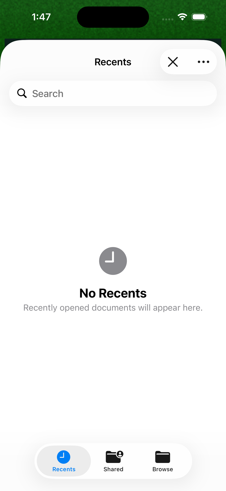
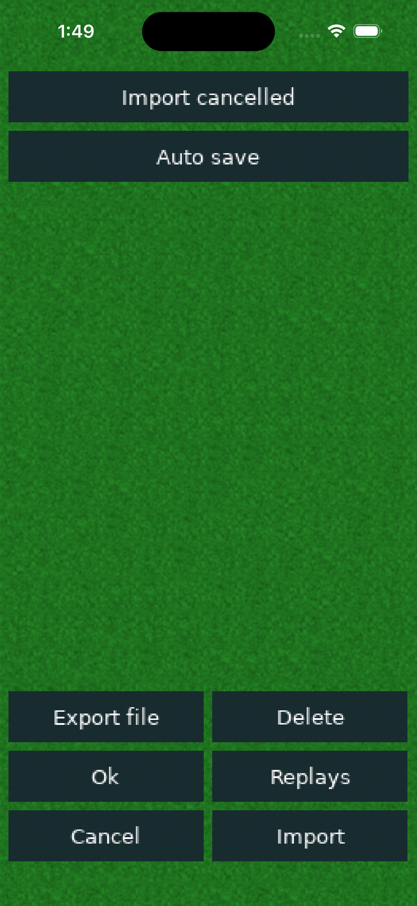
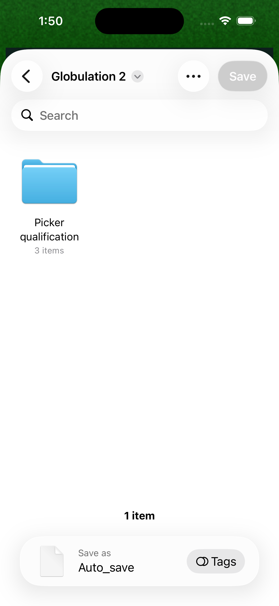

# Isolated iOS simulator interaction

## Verified on 2026-09-09

Meta idb 1.5.4 can send HID input and take screenshots on the worktree's custom
CoreSimulator set without opening or changing another thread's Simulator window.
See the upstream [commands](https://fbidb.io/docs/commands/) and
[FBSimulatorControl documentation](https://fbidb.io/docs/idb/fbsimulatorcontrol/).
This is optional qualification tooling, not an app or build dependency.

The tested Apple Silicon companion release is
`https://github.com/facebook/idb/releases/download/v1.5.4/idb-companion.macos-arm64.tar.gz`,
SHA-256 `cca3e9eecc08dbf9184818fe5a2a36ac42da189c02d82886add2122dece3b630`.
Verify the archive before extracting it under `build/mobile-tools/idb-1.5.4`.
Install `fb-idb==1.5.4` into a worktree venv with a worktree pip cache. The tested
resolved Python dependencies are aiofiles 25.1.0, grpclib 0.4.9, protobuf 7.36.1,
h2 4.4.1, hpack 4.2.0, hyperframe 6.1.0 and multidict 6.7.1. These versions record
the experiment; this document is not a complete hash-locked Python environment.

## Keep device and client state private

Use the owned UUID from `mobile/ios.py` and its explicit device set. The tested
companion invocation from the repository root was:

```sh
umask 077
DEVELOPER_DIR=/Applications/Xcode.app/Contents/Developer \
TMPDIR="$PWD/build/mobile-tools/tmp" \
build/mobile-tools/idb-1.5.4/idb_companion \
  --udid 478ACBC2-34A7-4B32-AB25-0F33CA707C5E \
  --device-set-path "$PWD/build/mobile-tools/ios-simulators" \
  --only simulator --grpc-domain-sock "$PWD/build/idb.sock" \
  --debug-port 0 --log-level info \
  --log-file-path "$PWD/build/mobile-idb-companion-detail.log"
```

The Python client normally stores state under `/tmp/idb`. Before importing
`idb.cli.main`, the local wrapper overrides `idb.common.constants`:
`BASE_IDB_FILE_PATH`, `IDB_PID_PATH`, `IDB_LOGS_PATH`, and `IDB_STATE_FILE_PATH`
to a directory and children under `build/mobile-tools/idb-state`.
Set `TMPDIR` to the worktree temporary directory for client calls too. Always pass
`--companion "$PWD/build/idb.sock"`; do not use default-device discovery or global
`idb kill`. Stop only the companion process started for this test.

First use `describe --json` and verify the UUID and device-set path. The tested
iPhone 16 has logical coordinates 393 × 852 and screenshot pixels 1179 × 2556.
Inspect a fresh screenshot before coordinate input. `ui tap X Y --reason TEXT`
uses logical coordinates. The SDL canvas and remote picker were not exposed as
individual elements by `ui describe-all`; this does not qualify VoiceOver.

## Picker results and limits

The release app successfully opens the native import sheet, browses On My iPhone
and Globulation 2 folders, returns the visible **Import cancelled** status, and
reopens after cancellation. Export opens a native sheet with the selected
`Auto_save` filename; dismissing that sheet also releases the operation so import
can open again.




The local provider did **not** complete selection of a valid `.game`, invalid
`.game`, or ordinary `.txt` file seeded in the app Documents folder. A valid save
seeded directly in the owned simulator's LocalStorage provider also failed.
Rebooting the owned simulator did not resolve this. Opening the standalone
Files app and browsing the local provider before retrying also did not resolve
it (`build/mobile-ios-files-retry.log`). The system DocumentManager
log reports `Couldn't get FPItem from node` / `NSCocoaErrorDomain Code=256` before
any app import callback. The export sheet disables Save in the app Documents
folder. This evidence points to a provider/runtime problem but does not establish
its root cause or qualify the app's import/export path. Do not change the file
filter based on this observation: even the standard text type fails.



Local evidence: `build/mobile-picker-system.log`, `build/mobile-idb-*.png`, and
`build/mobile-idb-companion*.log`. The valid fixture is 1,078,903 bytes with SHA-256
`e6168d53458f4d978a866c873901c0f7341f8bbabf19d5d1cf2b2120374ddf3a`.
Actual valid/invalid import callbacks, byte-identical export/reimport, cloud
providers and physical-device document access remain qualification gates.

## Profiling limit

The idb xctrace wrapper passes the same UUID to Apple's xctrace and then crashes
inside its own NIO async sequence handling. It did not produce a qualified trace.
Do not count this as an application crash or Instruments pass. Retain the passing
simulator LLDB and symbolicated process-sample evidence separately. A supported
Instruments/device workflow remains required.
