# Mobile verification and remaining work

Recorded 2026-09-08. Browser base: `c7c534b8d3af4b07c535d3d780fc5207531a1b6f`,
merged into the mobile branch in `0b977ab61`. iOS qualification uses Xcode 26.6
(17F113), SDK 26.5, and the iOS 26.5 ARM64 simulator runtime (23F77).
Android evidence below was collected before this browser merge, on `7333e4e8b`.

## Phone forms and adjustable dialog text (current)

- Campaign/tutorial, map choice, custom-game options, map creation, AI description
  and message screens use a native phone presenter with wrapped, scrollable rows.
  Buttons and numeric controls retain at least 48-point targets. Existing widgets
  and callbacks own state; desktop/browser presentation remains unchanged.
- In-game Dialog text size offers 100%, 125%, 150%; the setting also applies to
  phone forms. Variable-height dialog rows account for wrapped labels, and large
  footer groups preserve a reachable final action instead of covering content.
- Shared safe-area/keyboard geometry is used by native forms, menus and gameplay
  dialogs. Held form input is canceled on viewport resize. Floating iPad keyboards
  no longer reserve a full-width bottom strip.
- Native touch tests pass at 320×568 and 568×320, 100% and 150% form text. Coverage
  includes campaign cancellation, player toggle rules, AI selection, map dimensions,
  ratio limits and conditional visibility, and resize cancellation. Shared engine
  session/editor persistence tests pass.
- Android ARM64 developer release builds, signs, installs and launches on the
  isolated API 35 emulator. The tutorial chooser, software keyboard/name editing,
  Hide keyboard, mission preview, tutorial launch and in-game text-size selection
  were exercised. This is emulator evidence, not Pixel 6 qualification.
- iOS ARM64 simulator and Wasm release builds pass. Floating-keyboard behavior
  remains unqualified on an actual iPad. All 15 browser viewport checks pass
  across Chromium, Firefox and WebKit before the final native-only footer cleanup.
- PR #202's visual refresh was inspected but not imported: it does not provide
  phone form reflow. This pass retains existing game art and styling foundations.
  Pinch zoom remains deferred to the zoom PRs.

Emulator captures (API 35, 320×640, default dialog text):

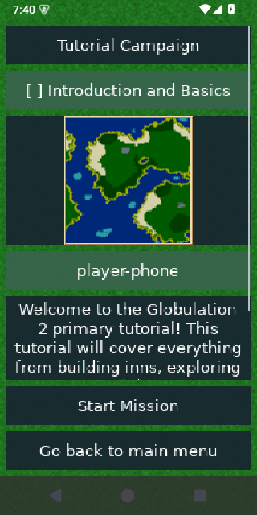
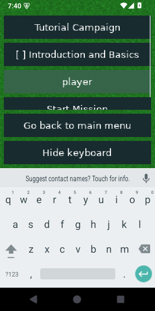

Remaining UI scope: the specialized map-editor workspace, global settings tabs,
end-of-match/statistics presentation, full translation/bidi/accessibility review,
and physical-device safe-area, keyboard and rotation qualification. This update
improves the path into gameplay; it does not complete the full mobile UI plan.
See [implementation notes](development.md#responsive-native-forms-and-dialog-text).

## Pixel 6 feedback preview (`b8c0a46f6`)

- Inspector tabs reflow into at most three columns, retaining 48-point row targets
  and readable captions in both orientations.
- Native touch tests pass for repair/upgrade initiation and loaded replay
  pause/speed controls. Healing cannot change a held Repair into Upgrade.
- Android ARM64 release rebuilt, developer signed, installed and launched on the
  isolated API 35 emulator. Tutorial gameplay, filename entry with the software
  keyboard, fixed dialog actions, Hide keyboard and save submission were checked.
- Wasm and iOS simulator release builds pass; 15 browser viewport checks pass
  across Chromium, Firefox and WebKit after these changes.
- Emulator reload testing exposed a shared USL garbage-collection lifetime bug.
  The fix clears persistent root marks between collections and marks live thread
  frames. A regression exercises 100 collections with a retained bridge value;
  the corrected APK successfully reloads the tutorial save from both the main
  menu and the running game. The same process remains alive and gameplay continues.
- All nine focused browser tutorial restart, background-input and persisted
  save/reload tests pass across Chromium, Firefox and WebKit after the GC fix.
- The Android emulator also verifies readable Actions tabs in the live match.
- See [device testing](device-testing.md) for the Pixel 6 installation and feedback
  route. No physical-device performance, thermal or complete-flow qualification
  is implied by this preview. The emulator showed a System UI ANR during cold
  boot before testing; it recovered after Wait. This is not game crash evidence.

## Resumed qualification (`89bea4560`)

- Explicit Info tab preserves building details alongside Actions.
- Held actions are canceled when the building/construction state changes.
- Native touch tests pass for ratios, clearing/flag controls, destruction and
  cancellation in both phone orientations; merged engine-session tests pass.
- New translation captions load correctly after repairing key/value pairing.
- All 30 browser viewport, shutdown-storage and campaign-editor-storage tests
  pass across Chromium, Firefox and WebKit after the merge/catalog correction.
- Wasm release and ARM64 iOS simulator builds pass. The current iOS application
  was installed and launched in the isolated iPhone 16/iOS 26.5 simulator; a
  captured main menu confirms startup only, not in-game/keyboard qualification.
- Android ARM64 release APK builds and passes developer signing with current Java/JNI/manifest changes after
  refreshing verified dependencies. This does not establish emulator/IME behavior.
- Visual inspection still finds awkward narrow-tab wrapping. Real keyboard,
  replay and live mobile qualification remain open.

## Broader UI handoff checkpoint (`f69f21b42`)

Read [HANDOFF.md](HANDOFF.md) before continuing. This expands building Actions,
in-game dialogs, menu actions, replay controls, and keyboard/inset handling.
The native gameplay-touch harness builds and passes, including options, objectives,
filename text entry, save cancellation, and chat in both phone orientations.
The Wasm release and ARM64 iOS simulator application builds also pass for this
checkpoint. Browser runtime suites and simulator launch were not repeated.
Android changes and replay/Actions-sheet behavior still need the targeted tests
and device runs listed in the handoff. **The in-game UI is not finished.**

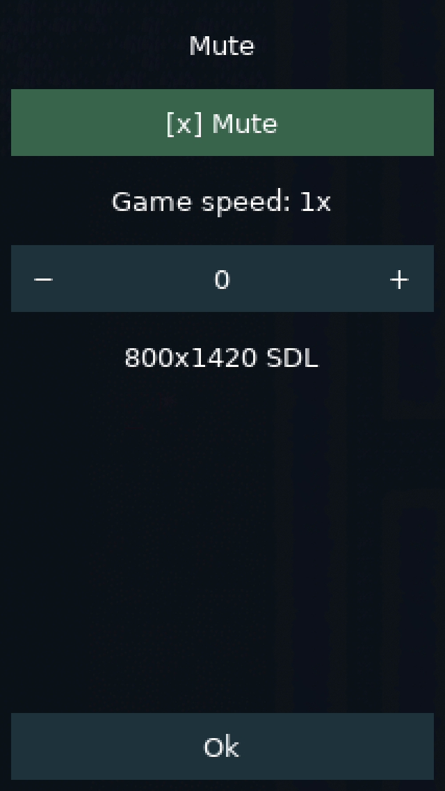

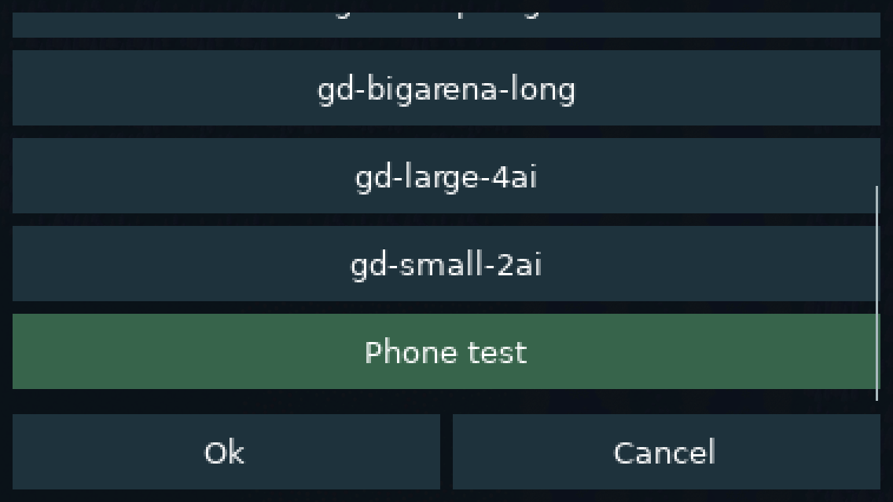

These are native regression captures, not emulator/live-match evidence. The
following older evidence remains scoped to the commits identified in each section.

## Current evidence

| Area | Evidence | Limit |
| --- | --- | --- |
| Desktop and browser | Native macOS release and Wasm release builds pass | Other desktop platforms not rebuilt locally |
| Android ARM64 | Release APK packaged, alignment checked, developer signed, installed and launched on API 35 ARM64 emulator | No physical device qualification |
| Android ARMv7 / x86-64 | Release APK builds, ELF/package alignment checks, and developer signing pass | No launch evidence on these ABIs |
| iOS device / simulator | ARM64 simulator and unsigned device apps build with matching dSYMs; simulator install, main menu, tutorial, touch selection, rotation, and retained-session resume pass | Signed physical-device installation and iOS 15 hardware remain unverified |
| Shared lifecycle | Native screen/session/renderer harnesses pass; Android retained-activity background/resume exercised | Killed-process and multiplayer recovery unfinished |
| Native touch and viewport | Responsive-menu and gameplay-touch integration harnesses pass; Android tutorial selection, placement, confirmation, rotation cancellation, and pan exercised | Complete phone panels and editor touch parity unfinished |
| Browser compatibility | 39 focused viewport/storage/import/protocol cases pass across Chromium, Firefox, WebKit after the latest merge | Not mobile Safari/Chrome device qualification |
| Build tooling | 21 Python checks pass, including invalid identities, archive alignment, signed APK provenance, fail-fast iOS requests, and explicit simulator device-set routing | Does not prove iOS linking or IDE debugging |
| CI | Android ABI matrix now packages, checks alignment, signs developer APKs, and collects symbols/diagnostics | Updated workflow has not yet been run; no automated emulator or iOS simulator gate |

The three native 50-tick engine-session variants agree on `7e7f31de` after
background and child-screen interruption. This is a lifecycle regression result,
not the requested 100,000-tick ARM/Wasm determinism qualification.

On the earlier `017d5b437` browser base, native renderer, screen lifecycle, gameplay touch,
and engine-session harnesses pass. In the browser run, 13 of 15 cases passed on
the first attempt. Two Chromium WebGL2 cases timed out on slow simulation progress
while iOS compilation and runtime setup were active; both passed unchanged in an
isolated rerun (30.4 seconds). The earlier browser-base storage evidence is not a
substitute for full post-merge storage qualification.

## Prior browser synchronization (`6d1d8bbae`)

Merge `d6f754dd5` incorporates browser head `6d1d8bbae`: validated imports,
campaign backup/recovery, durable editor save completion, and symmetric YOG
protocol admission. Both independent GameGUI members were retained when
resolving the merge conflict; mobile touch ownership and import preference
isolation remain separate.

After this merge, native gameplay-touch, screen, renderer, engine-session,
transport and savegame-safety harnesses pass. Save tests include imported-file
validation and pending/failure/retry cleanup, campaign backup validation and
atomic failure preservation. All three session checksums remain `7e7f31de`.
Desktop, Wasm and ARM64 iOS simulator application builds pass. All 39 focused
browser cases pass across Chromium, Firefox and WebKit: viewport changes, map
import, campaign progress backup merging, editor quota/transaction failures,
and symmetric protocol admission/incompatible-version rejection. Logs are
`build/allocation-merged-{native-tests,browser-tests,desktop,web,ios}.log`.
This pass does not add
Android packaging, simulator launch, or physical-device qualification.

## PR #198 layout integration

The layout foundation from #198 (`befa80298`) is selectively ported; see the
[architecture notes](architecture.md#shared-resizing-foundation-from-pr-198)
for retained mobile/browser behavior and exclusions. Verification for this port:

- 173 CppUnit tests pass, including editor anchors across phone/tablet widths.
- Native screen lifecycle, SDL renderer, responsive-menu, and gameplay-touch
  harnesses pass. Screen checks now cover layout before input/paint and dialog
  clamping, centering, and oversized origins.
- Wasm release build passes. All 15 viewport cases pass across Chromium,
  Firefox, and WebKit (56.1 seconds), covering menus, running matches, editor
  dialogs, minimum viewports, and high-density displays.
- ARM64 iOS simulator release app and dSYM rebuild successfully. The first
  packaging invocation could not find CMake on PATH; selecting the existing
  task-local CMake with `--cmake` completed the build.

The simulator was not booted again and Android/device builds were not rerun for
this port. Existing screenshots and device evidence predate these layout changes.
This does not yet address the legacy gameplay canvas's small phone text.

## In-game HUD verification

Native renderer, screen lifecycle, and gameplay-touch harnesses pass. New checks
cover UI transform clipping/restoration, enlarged panel selection in 320×568 and
568×320 windows, scrolling without camera movement or game orders, minimap centering against the
phone world viewport, and tutorial
scrolling versus acknowledgment. The retained simulation checksum is unchanged
by these UI actions. Twelve mobile build-tool tests pass. All 15 browser viewport
cases pass across Chromium, Firefox, and WebKit; Wasm and iOS simulator release
builds pass. The simulator app installs and launches on the isolated device.
Android packaging/device qualification has not been repeated for this change.
Simulator launch was checked before the final minimap-centering adjustment; the
final simulator app was rebuilt afterward. The isolated simulator was shut down
after checking launch as its retained caches left roughly 1 GiB free on the host.
The separate iPhone 17 simulator session was not changed.

These screenshots are **native regression-harness captures**, not emulator or
live-match qualification. The fixture reveals terrain explicitly and has no
initialized colony counters. It exercises real game drawing and touch dispatch.
They do not demonstrate iOS safe-area behavior or real-device performance.

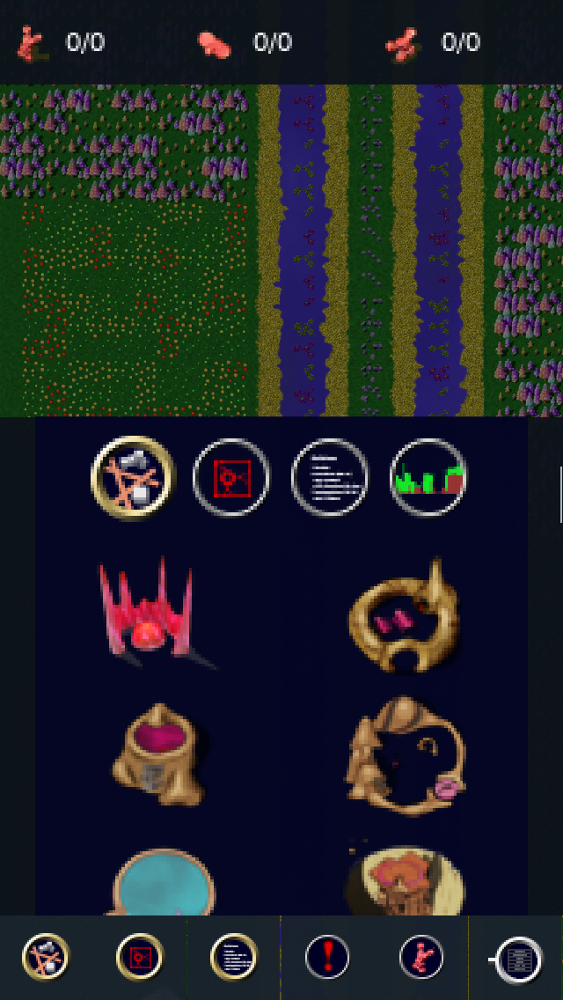

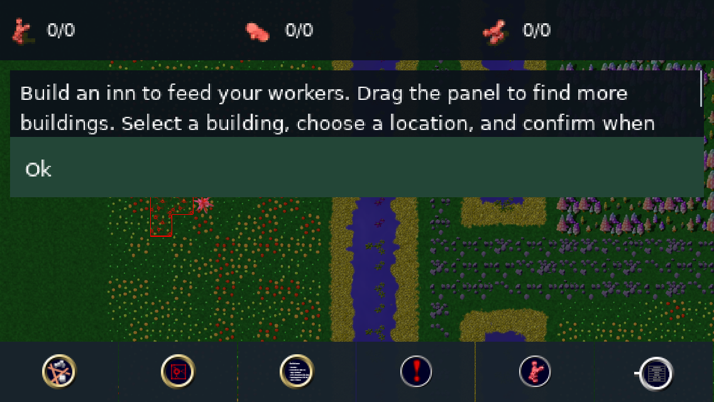

See [in-game HUD architecture and limitations](architecture.md#in-game-phone-hud).

## Worker allocation and pause-menu verification

Native gameplay-touch, screen lifecycle and portable-renderer harnesses pass.
New phone tests exercise rapid worker taps, exact queued gid/count values,
authoritative checksum preservation, zero/maximum no-ops, selection-change
cancellation, and dragged-versus-tapped Return buttons in both orientations. Device-switch
tests prevent stale mouse/touch menu coordinates from activating an action,
including a two-finger sequence while switching back to touch.
The Wasm and ARM64 iOS simulator application builds pass, along with all 15
browser viewport cases across Chromium, Firefox, and WebKit.

The captures below are native regression fixtures, not emulator screenshots.
They include a test building and revealed terrain, with no live colony counters.

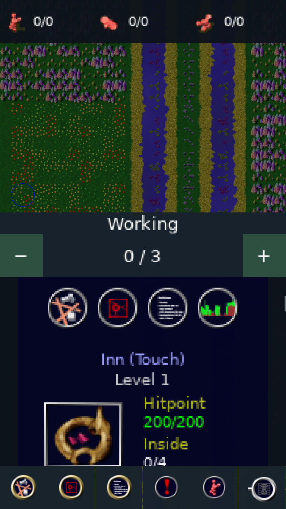

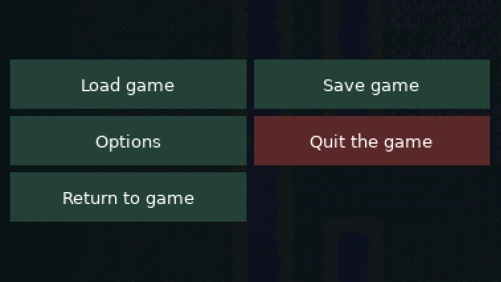

The iOS archive step exhausted temporary disk space. Failed simulator archives
and stale iOS **device** objects/core archive were removed and regenerated as
needed; source, SDKs, packaged device app, symbols, and captures were preserved.
The next device rebuild will recompile its core. No simulator boot or Android
packaging run is claimed for this change.

## Priority and flag range controls

Commit `433a03f08` adds fixed 48-point inspector tabs and controls. Priority
shows low/medium/high choices with pending selection feedback; flags expose
range minus/plus controls. The 96-point header stays visible while details scroll.
The existing game orders, type-specific range limits, and translated labels are
shared with desktop controls. Production ratios, flag resource/level controls,
and remaining in-game dialogs still need dedicated phone layouts.

After merging browser settings persistence (`46a4d56d0` in `b92c89935`), native
phone-touch, engine-session and savegame-safety checks pass, including exact
priority/range orders, no-ops, selected-building cancellation, settings completion,
and prior preference/keyboard file preservation on failure. The three session
checksums remain `7e7f31de`. Desktop, Wasm and ARM64 iOS simulator builds pass;
all 27 browser viewport/settings-persistence cases pass across Chromium, Firefox
and WebKit. Logs are `build/priority-merged-*.log`. Android packaging, simulator
launch and physical-device qualification were not repeated in this pass.

The captures are native phone-size test fixtures, not emulator or live-match
qualification. They expose terrain and test buildings without live colony counts.

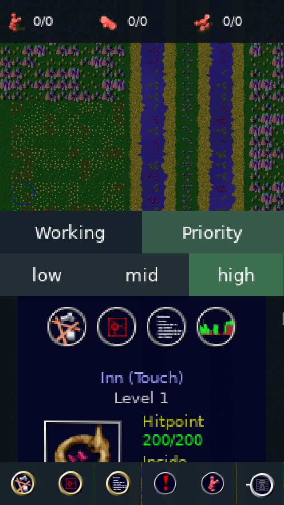

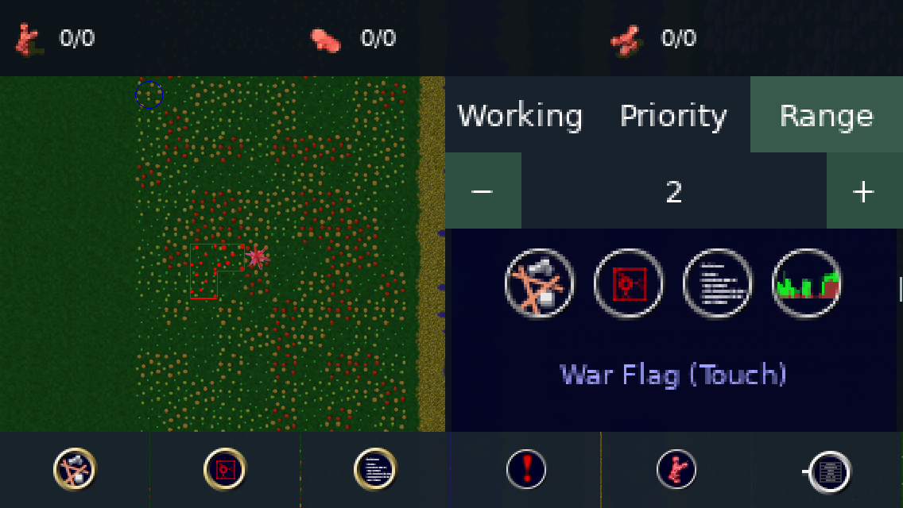

## iOS simulator screenshots

Captured on an isolated iPhone 16 / iOS 26.5 simulator. The game reaches its main
menu and a running tutorial, selects units/buildings, rotates, and resumes the
same process after Home/backgrounding. No device signing credentials were used.

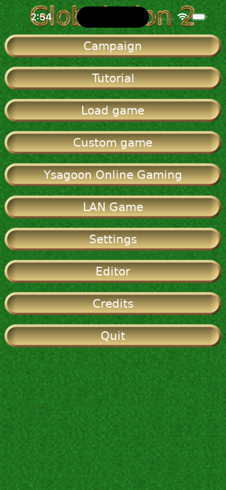

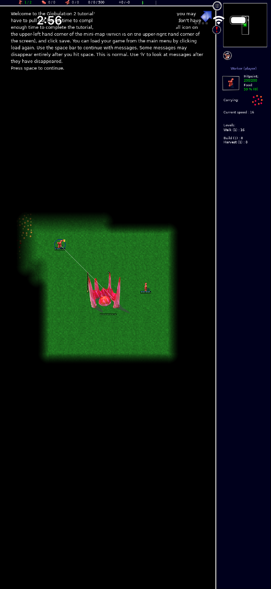

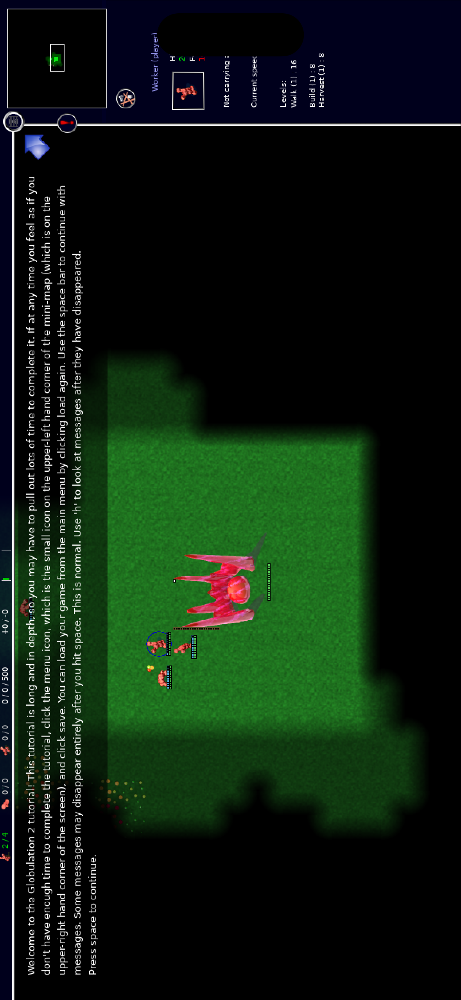

The screenshots expose remaining layout work: status bar/notch overlap with the
legacy HUD, small legacy dialogs/panels, and missing touch tutorial instructions.
These are not claims of complete phone usability. The simulator's first boot took
about two minutes. Runtime registration required `simctl runtime scan-and-mount`;
a duplicate record referred to the same runtime image and was left intact.
First-boot caches exhausted most remaining host disk space. After verification,
the isolated simulator was shut down and rebuildable iOS dependency intermediates,
cached Android installers, and the optional exported runtime copy were removed.
Apps, core/dependency libraries, matching symbols, device data, logs, and screenshots
remain. Approximately 3.5 GiB was free after cleanup; more headroom is needed for
further clean builds or additional simulator devices.

## Android emulator screenshots

Captured on the API 35 ARM64 emulator on 2026-09-08, using runtime commit
`7333e4e8b`. These are existing captures from the touch/viewport smoke test.
Dark world regions are unexplored terrain; legacy panels and tutorial text still
need phone reflow. These screenshots establish functional rendering, not device
performance or iOS support.

Portrait placement preview with the explicit Confirm/Cancel strip:

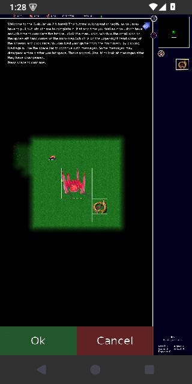

Portrait after confirming construction through the shared game order:

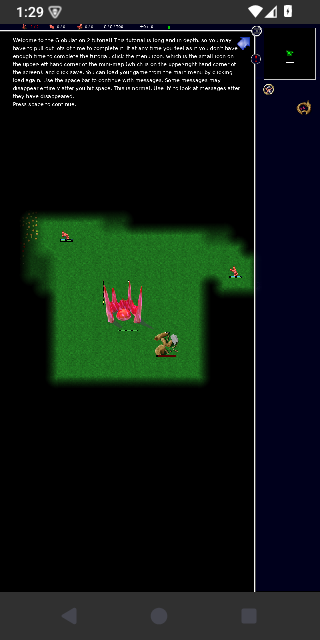

Landscape after rotation cleared the placement gesture (confirmation disabled):

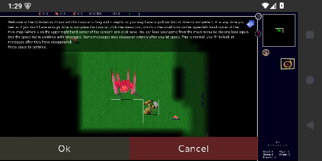

## Reproduction artifacts

The [developer guide](development.md) contains build and regression commands.
Local ignored artifacts in the mobile worktree include:

- `build-touch-fullscreen-tests.log`: native renderer, screen, menu, touch, session checks.
- `build-touch-fullscreen-browser-tests.log`: nine browser checks.
- `build/touch-fullscreen-*.png`: Android portrait/landscape, selection, placement and pan captures.
- `build-ios-tool-tests.log`: 21 build-tool checks.
- `build-ios-simulator-final.log`, `build-ios-device-final.log`: successful app builds.
- `build-ios-native-test-results.log`: merged native regression results.
- `build-ios-browser-tests.log`, `build-ios-browser-rerun.log`: browser results and reruns.
- `build-ios-boot.log`, `build-ios-launch.log`, `build-ios-resume.log`: first boot and same-process resume.
- `build/ios-app-data-path.txt`: isolated writable container location.
- `build-foundation-armv7.log` and `build-foundation-x86_64.log`: current ABI packaging runs.

Release developer APKs live under
`build/android/device/<abi>/26/client/release/android-project/app/build/outputs/apk/release/`.
Signing keys remain local and are not CI artifacts. CI uses runner-provided SDK
packages and Java 17 alongside the pinned NDK and Gradle; a fully archive-pinned
Linux JDK/SDK bootstrap remains to be completed.

Both iOS binaries identify their correct platform (IOS versus IOSSIMULATOR),
minimum OS 15.0, and SDK 26.5. Their dSYM UUIDs match. The generated Xcode project
keeps build caches in its target output; Apple manages Xcode and runtime storage
system-wide, and simulator device data stays in `build/mobile-tools/ios-simulators`.
No physical-device signing identity or provisioning profile has been qualified.

## Next foundation gates

1. Qualify locally signed iOS physical-device installation and address iOS safe-area,
   status-bar, and keyboard occlusion in the shared UI integration.
2. Run Android CI packaging and launch checks on the remaining ABIs; add automated
   emulator/simulator startup, lifecycle, and asset-path checks with diagnostics.
3. Finish incremental modal/lifecycle coverage and durable native storage before
   relying on background or process recovery. Qualify graphics restoration on devices.
4. Verify IDE native debugging, release symbols, sanitizer support, and profiling;
   complete host toolchain pinning and reproducible clean-build evidence.

Pinch zoom is explicitly deferred. Further phone panel/editor reflow, browser touch
integration, native system WebSockets, coordinated network recovery, transactional
saves, import/export, and full mobile-browser support remain planned work.
Do not claim the full six-milestone mobile delivery is complete.

## Device qualification still required

The target is iOS/iPadOS 15+ ARM64 and Android 8+ ARM64/ARMv7, including 2 GB devices.
Required hardware includes a first-generation iPhone SE or equivalent, a 2 GB
Android 8 ARMv7 device, modern Android ARM64, and iPad. Emulation is insufficient.

The fixed 128×128 four-player late-game fixture must sustain 25 simulation ticks/s
and at least 30 rendered frames/s for 30 minutes below 500 MiB peak process memory.
Newer hardware targets 60 FPS. Cross-architecture 100,000-tick checks, mixed-platform
multiplayer, thermal/audio interruption, browser eviction, and storage fault tests
remain unqualified. Larger maps must load or fail clearly without changing rules.

The emulator displayed a System UI nonresponse dialog during concurrent compilation
and recovered with Wait. No device performance conclusion follows from that run.
Voice chat, cloud saves, store submission, and new visual identity remain deferred.
