# Mobile verification and remaining work

## 2026-09-09 — isolated iOS picker interaction

Hosted mobile run 34315653259 passes at `b9806743d` without retries: all three
Android ABI packages and symbol IDs, x86-64 lifecycle/trust and iOS lifecycle.
The general browser/desktop run 34315653163 is still in progress.

The unsigned ARM64 device release app also rebuilds successfully with iOS 15.0
minimum / SDK 26.5. Its binary and dSYM both report UUID
`B0E2D375-F419-309E-A162-C99C104B74AF`. This verifies device compilation and
symbols, not installation without an Apple signing identity/profile. A second
100,000-step run on `maps/Isles.map` (128×128, four Castor AIs, seed 42) also
passes all 101 native ARM64/Wasm component/checksum/RNG checkpoints. The local
runner used the existing map query and corresponding native map argument;
results are in `build/mobile-determinism/isles/result.json`. These host runs
do not qualify mobile frame-time or thermal budgets. Device-build logs:
`build/mobile-final-ios-device-build.log` and `build/mobile-final-ios-device-uuids.log`.

Task-local idb 1.5.4 now provides HID input on the owned iPhone 16 simulator
without opening another thread's Simulator window. Native import presentation,
local folder browsing, visible cancellation and reopening pass. Export presents
the selected autosave name and releases the operation when dismissed.

Selection remains blocked inside the simulator LocalStorage provider: valid game,
invalid game and plain text fixtures all fail to resolve an FPItem, and export
Save stays disabled. Reboot and a fixture in provider storage did not help.
The idb xctrace wrapper also crashes in its own NIO implementation; it does not
close the Instruments gate. [Reproduction and screenshots](simulator-interaction.md)
record these limits. No app code was changed on the basis of these tool failures.

## 2026-09-09 — final browser CI follow-up

Mobile run 34312370889 passes at `530b7b74b`, including every Android ABI,
APK/debug-symbol build-ID matching, x86-64 lifecycle/trust and iOS lifecycle.
The x86 job passed on retry after a transient emulator DNS failure before TLS.
Both Linux jobs, Windows and all build-isolation orders also pass at that commit.

The broad browser run passed 213 cases and found 12 failures. Six expected the
browser branch's old LoadSaveScreen name instead of the integrated ReplaySaveScreen.
Resize cases sent keys while the shared host was deliberately cancelling the
resize event batch; they now wait for two completed host frames after dimensions
change. The lifecycle cancellation policy is unchanged. A Firefox shutdown race
also exposed ignored resume promises inside SDL itself: only SDL-owned audio
contexts are now observed, with original promise results preserved and late
closed-context rejections handled. No global AudioContext API is replaced.

All 18 targeted browser regressions now pass across Chromium, Firefox and WebKit
in both default and WebGL modes (36 executions), and all 15 browser unit tests pass. CI separates default runtime, WebGL and
visibility stages so subsequent failures are visible without waiting for every
renderer invocation. Full CI reruns remain linked from PR #208; do not equate
these targeted results with a full release qualification.

## 2026-09-09 — browser reconciliation and final integration checks

Merged browser checkpoint `1658ff670`, including upstream map/AI save changes and
normal cross-play match endings. Mobile retains its scheduled ReplaySaveScreen
and checked buffered atomic writer. The draft PR is mergeable after this merge.

Post-merge verification passes:

- Android ARM64 and iOS ARM64 simulator release builds; both local lifecycle
  smokes, including Android rotation; Android system-trust instrumentation.
- Native save fault/process-death and touch/session suites, 26 build-driver tests,
  14 browser unit tests, eight gateway tests and seven native WSS tests.
- 54 replay-storage and single-player browser cases across all three browsers.
- All six native/Wasm TCP and WSS cross-play cases, including normal match
  endings and checksum agreement, on Chromium, Firefox and WebKit.
- Another 100,000-step ARM64/Wasm run with all 101 checkpoints matching. Timing
  during concurrent test work is recorded separately and is not a device budget.

Android linking now emits a SHA-1 ELF build ID. Packaging rejects a missing,
ambiguous or mismatched ID between the APK's stripped main library and retained
debug symbols. The previous preview had no GNU build ID; this is corrected in the
refreshed package. All 27 build-driver/symbol checks pass. The current iOS app and
dSYM both have UUID `F9240C11-8DB8-3809-9F7D-C298E070EDA0`.

Native cross-play fixtures now reserve private ports, matching the existing
private profiles, and wait for their embedded router before announcing readiness.
Native WSS route selection uses the shared protocol port constant so the same
transport also works with those test-only port assignments. Production ports are
unchanged. A missing explicit `<cstring>` include caught by Ubuntu 22.04 CI is
fixed in the save harness.

Hosted mobile run `34310898922` successfully packaged ARM64, ARMv7 and x86-64 and
passed x86-64 startup/lifecycle/rotation and trust instrumentation. Its iOS
startup/lifecycle job also passed: the mobile run is fully green. Subsequent runs
for the last fixture and packaging checks are linked from PR #208.
Clean hosted packaging plus local rebuilds provide functional reproduction, not
byte-identical signed-archive qualification or a complete host-toolchain lock.

A ten-second stack sample of the isolated iOS app contains symbolicated
`Application::frame` and `Glob2.cpp` source locations
(`build/mobile-final-ios-sample.txt`). Instruments cannot discover this custom
simulator set (`build/mobile-final-profiler-isolated.log`); its qualification stays
open. LLDB attachment and matching app/dSYM identities were verified previously.
A ten-second scheduler/graphics/view/frequency atrace capture also succeeds on the
private Android emulator (`build/mobile-final-android-systrace.txt`); this validates
trace collection, not physical frame-time or thermal budgets.

## 2026-09-09 — stale-file cleanup and long simulation checks

Mobile startup now removes abandoned atomic-write files bearing the explicit
`.glob2-tmp-PID-sequence` suffix only when the owning process is confirmed dead.
Bounded traversal, no-follow opens, inode checks and cleanup locks preserve live
writes, symlink targets, legacy ambiguous names and both recovery generations.
iOS export staging similarly uses PID-tagged directories and bounded cleanup.
Native cleanup and save fault/process-death suites pass; cleanup/document harnesses
also pass AddressSanitizer and UndefinedBehaviorSanitizer. Android ARM64, iOS
simulator and Wasm release builds pass with this cleanup. All 24 browser import
and campaign-persistence regressions pass across Chromium, Firefox and WebKit.

The new `mobile-determinism-test` target runs the real headless engine with four
Castor AIs on `maps/balanced.map` (128×128, seed 42). The private-profile comparison
runner completed 100,000 steps with all 101 component/checksum/RNG checkpoints
identical between native macOS ARM64 and Chromium Wasm. Native simulation p95 was
278 microseconds, Wasm p95 400 microseconds; native peak RSS was 36,143,104 bytes,
Wasm allocated heap 134,217,728 bytes. These are host headless measurements, not
mobile rendering, device memory or thermal qualification. Automatic match-ending
is disabled so the fixed-length fixture continues through changing victory flags.
Evidence: `build/mobile-determinism/long-run/{result.json,native.log,wasm.log}`.

Hosted run 34309372465 packaged all three Android ABIs. Its x86 smoke launched
while the fresh emulator applied resource overlays; the next driver waits for a
stable configuration. Its iOS smoke hit an absent-process termination timeout;
the next driver checks running services first and preserves primary diagnostics
if final cleanup times out. Hosted lifecycle qualification remains pending rerun.

Recorded 2026-09-08. The current continuation merges browser `246a47d50`;
the preceding mobile checkpoints used browser `9dc201436`.
The older sections retain their original checkpoint IDs and evidence. The prior
browser base was `c7c534b8d3af4b07c535d3d780fc5207531a1b6f`, merged in `0b977ab61`.
iOS qualification uses Xcode 26.6
(17F113), SDK 26.5, and the iOS 26.5 ARM64 simulator runtime (23F77).
The historical Android screenshots near the end were collected on `7333e4e8b`.

## Platform certificate trust, iOS symbols and hosted-run fixes

Native mobile WSS now delegates certificate-chain policy to Android's default
X509TrustManagerExtensions and Apple's SecTrust SSL policy. The common boundary
also requires a matching DNS/IP certificate identity, bounds the supplied DER
chain and fails closed on platform errors. Existing Beast/OpenSSL WebSocket
framing, TLS encryption, deadlines and queue limits remain shared with desktop;
this is not a URLSession/Java WebSocket rewrite. Apple intermediate discovery is
offline so it cannot introduce a network fetch into a game frame. A gateway must
serve its intermediate certificates.

The native certificate harness passes identity mismatch, rejected trust, malformed
request and chain-count checks. The Apple backend accepts GitHub's currently valid
public chain and rejects the same chain for a different host and an unknown issuer.
Android API 35 instrumentation independently performs a normally validated TLS
handshake to GitHub, then tests the bridge against that chain, unknown/malformed
certificates, trailing data, empty input and excess chain length. All pass. The
instrumentation is a separate developer APK; it does not run during normal startup
or alter the device trust store. Mobile gateway traffic and mixed-platform play
still need end-to-end qualification.

Apple archive members now have stable unique names. This fixes dsymutil dropping
source files with identical basenames, and recreating the archive removes obsolete
members after source renames. All three `Lifecycle.cpp` compilation units now
appear in the dSYM; app/dSYM UUIDs match. LLDB attached to the task-owned iOS
simulator, hit `Application::mainMenu`, produced source-level C++ backtraces and
detached successfully. Optimized release variables may still be unavailable.
Android Studio/device attachment and Instruments/sanitizer qualification remain.

All 26 build-system checks pass. Android ARM64 and iOS simulator release builds
pass. The updated iOS smoke runner passes locally; retained-process activation
keeps the existing output streams and has a bounded, configurable simctl timeout.
The preceding document checkpoint also passed all 24 browser import/campaign tests
plus three chooser-error tests across Chromium, Firefox and WebKit.

Hosted run `34306967935` reached the iOS native main menu but timed out activating
the retained process with new output redirects. Run `34308016912` passed all three
Android APK builds and emulator registration, then exposed inherited
`ANDROID_HOME` pointing at the runner SDK. The emulator wrapper now explicitly sets
both SDK variables to its worktree and configures a small deterministic screen for
new AVDs. A regression test supplies a conflicting runner SDK and verifies the
isolated environment. Updated hosted launch qualification is still pending.

Evidence: `build/mobile-trust-*`, `build/mobile-symbol-*`,
`build/mobile-debug-lldb.log`, and `build/mobile-ci-*`.

## Native document import/export and SDK registration

Android uses the system document picker for imports and exports. iOS uses
UIDocumentPicker with copied imports and exports staged in a private temporary
file. Platform callbacks are detached from screen lifetimes through request IDs;
reads are capped at 64 MiB, duplicate callbacks are ignored, and filenames/complete
formats are validated before existing atomic import code creates a new save.
Exports retain their own bytes until the provider finishes or the user cancels.
Platform export errors use the existing localized game error string. Provider
completion is not a guarantee against device power loss or remote-cloud failure.

Android API 35 verification includes picker cancellation, invalid-game rejection,
and export/import/re-export of a real tutorial save. Both exports are byte-identical:
1,078,903 bytes, SHA-256
`e6168d53458f4d978a866c873901c0f7341f8bbabf19d5d1cf2b2120374ddf3a`.
The imported save receives a new name, preserving the original. New status text
now scrolls into view on phone forms; unchanged status does not disrupt scrolling.

Native callback/size/name tests, touch, savegame safety and engine-session tests
pass. All 24 build-system checks pass. Android ARM64, iOS ARM64 simulator and Wasm
release builds pass. Final Android and iOS lifecycle smoke runs pass. iOS picker
interaction itself and third-party/cloud document providers still need qualification;
the available Simulator UI is attached to a separate device set, which was left
untouched. Logs are under `build/mobile-documents-*`.

Hosted run `34306967935` at browser-merge checkpoint `47725148f` packages ARM64 and
ARMv7 successfully. x86-64 packaging succeeds, but AVD creation finds no registered
emulator package after direct archive extraction. Setup now installs the matching
SDK metadata (without changing license acceptance). A fresh task-local SDK test
reproduces the failure before metadata and passes afterward. The checked-in
metadata comes from the pinned Android Emulator 37.1.11 package. Hosted verification
of the fix is pending; this run does not yet qualify emulator startup.

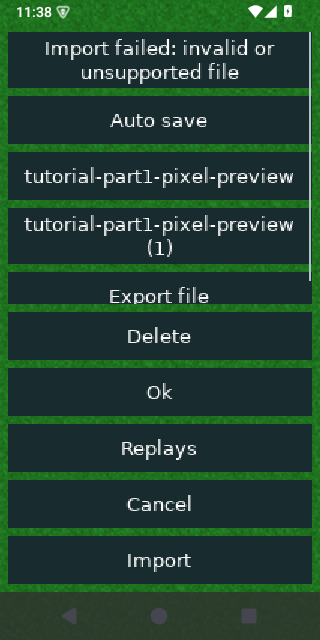
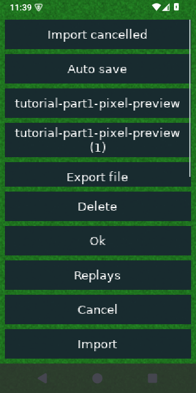

## Browser-base reconciliation and isolated LAN validation

The mobile branch incorporates browser `246a47d50`: scheduled LAN/YOG startup,
cooperative in-game reloads, removal of Asyncify, interpreter lifetime fixes and
headless map-header isolation. Merge resolution retains phone loading forms,
recovery checkpoints/final-save errors and input cancellation. A game screen now
checks whether it still owns its engine while a scheduled loader holds it.
The browser collector supersedes the older mobile root-mark workaround.

All 51 targeted browser regressions pass across Chromium, Firefox and WebKit.
Native savegame-safety, engine/session/reload/interpreter and touch suites pass.
All 23 build-system checks and 14 browser JavaScript unit tests pass. Android ARM64,
iOS ARM64 simulator and the non-Asyncify Wasm release compile successfully.

The first LAN run could not bind port 7489 because the separate browser checkout
was running its own qualification server. That process was left alone. The runner
now reserves a temporary three-port range via `GLOB2_TEST_PORT_BASE`, validates
that the binary supports isolation, uses separate profiles under its output path,
and does not broadcast its diagnostic lobby onto the LAN. Normal protocol ports
remain 7489/7490/7491. Both real join/ready/leave cycles and byte-identical map
transfers pass using the isolated ports; cancellation and greeting-timeout checks
also pass. Logs use `build/mobile-browser-merge-*`.

## Single-player recovery and automated mobile smoke checks

Recovery retains two CRC-checked generations inside a bounded 64 MiB envelope
and publishes them through an atomic commit record. Native single-player sessions
checkpoint at entry, every 30 seconds of wall time when the game has advanced,
and when screen execution is interrupted (including backgrounding). Campaign
identity/mission context is retained and campaign progress is saved before closing
recovery. A failed final save keeps recovery available and shows an error.

Startup offers Recover game, Discard recovery and Later. Loading validates the
whole game cooperatively and falls back to the older generation using a fresh
Engine if necessary. Generations from another game session are excluded. Existing
`.game` bytes remain unchanged inside the envelope; editor drafts, replay playback
and network sessions are not automatically recovered. The existing periodic
ordinary autosave remains available. Recovery is native-mobile only, with
`GLOB2_RECOVERY_TEST=1` enabling it for desktop harnesses.

Verified before the next browser-base reconciliation:

- Savegame-safety tests pass: every truncation of a recovery fixture, checksum
  corruption, serialization failure, generation/session isolation, dismissal,
  materialization and ordinary-save equivalence. The legacy map fixture's version
  upgrade changes its header checksum during any save/load; all other live
  checksum components match, and the full checksum matches an ordinary reload.
- Engine-session tests pass: initial/background checkpoints, full-game load
  failure fallback, campaign restoration and Later retention. Existing deterministic
  session checksums remain `7e7f31de`. The native touch suite passes.
- Android ARM64 release/signing, iOS ARM64 simulator release and Wasm builds pass.
  All 23 build-system checks pass. All 36 browser viewport/map/campaign/replay
  checks pass across Chromium, Firefox and WebKit (2.6 minutes, no retries).
- Automated Android API 35 smoke passes native startup/assets, same-process
  background/resume, landscape/portrait rotation and a fresh-process relaunch.
  A tutorial was then backgrounded/force-stopped, and the recovery prompt restored
  the mission in the new process. Screenshots are retained below.
- Automated iOS 26.5 simulator smoke passes native startup/assets, same-process
  background/resume via Settings, and termination/relaunch. This is simulator
  evidence, not signed physical-device installation.

`mobile/smoke.py` and `mobile/ios_smoke.py` require explicit task-owned targets and
write screenshots/logs/results under `build/mobile-smoke*`. CI now runs Android
x86-64 emulator smoke and iOS ARM64 simulator smoke in addition to three Android
ABI packaging jobs. Emulator/image archives, Linux command-line tools and Python
build-driver versions are pinned. Hosted execution of this updated workflow is
pending reconciliation with browser `246a47d50`: PR #208 is currently conflicting,
which prevents new pull-request checks. The older hosted mobile run at `e1e152ce0`
passed ARM64, ARMv7 and x86-64 APK jobs; that is not evidence for this new code.

Logs use `build/mobile-recovery-*.log` and `build/mobile-continuation-build-tests.log`.
Physical storage latency, sudden power loss, low-storage behavior and extended
mobile sessions still need qualification. See [remaining-work](remaining-work.md).

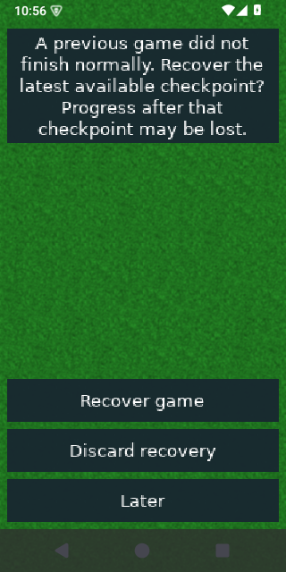
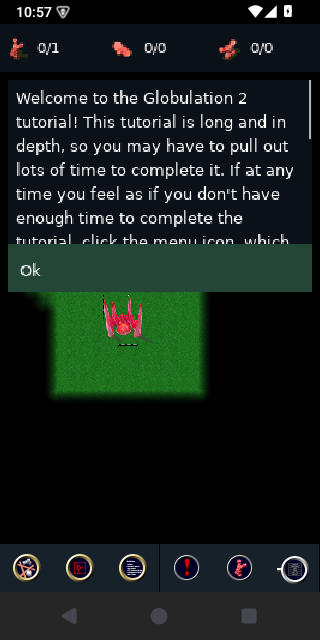

## Previous: native storage synchronization checkpoint

While physical Pixel 6 testing is pending, atomic saves now synchronize native
file contents before replacement and the parent directory after replacement.
Apple builds also request `F_FULLFSYNC`; Windows uses `_commit` and write-through
replacement. Interrupted system calls are retried on POSIX. Browser saves retain
the existing asynchronous IDBFS persistence step. Save formats are unchanged.
This covers the existing atomic callers: games/autosaves, maps, campaigns and
progress, replays, settings, key bindings and imported files.

A file-sync failure preserves the old destination. A directory-sync failure after
rename reports failure but keeps the complete new destination: its durability is
uncertain. A killed partial writer may leave an ignored `.tmp-*` file; automatic
orphan cleanup and recovery generations are not implemented in this checkpoint.
Newly created ancestor directories are not recursively synchronized.

Native savegame-safety checks pass, including injected file/directory sync faults,
SIGKILL before replacement, and SIGKILL after successful completion followed by a
fresh reader. Android ARM64 release/signing, iOS ARM64 simulator release and Wasm
release builds pass. All 21 browser map/campaign/replay persistence cases pass
across Chromium, Firefox and WebKit (1.9 minutes, no retries). Logs use
`build/mobile-storage-*.log`. These tests do not
simulate power loss or qualify mobile hardware; Windows was not runtime-tested.
Physical save latency, background termination/recovery and storage exhaustion
remain device gates. Apple documents full sync as a best-effort persistence
request, with performance costs, rather than a power-loss guarantee:
[Apple storage guidance](https://developer.apple.com/documentation/xcode/reducing-disk-writes).
Parent-directory synchronization follows the
[fsync contract](https://www.man7.org/linux/man-pages/man2/fsync.2.html).

## Native map and campaign authoring UI

This pass completes the remaining authoring-screen adaptation after `e1e152ce0`.
The specialized map workspace now uses a full-width map, explicit pan/edit mode,
fixed category tabs, scrollable tool groups, enlarged team/brush controls,
wide value adjustments and a larger minimap. The original widgets and actions
still own terrain, buildings, units, areas and team edits. Map/replay formats and
simulation orders are unchanged.

Editor menu/load/save, area naming, teams and scenario dialogs use the phone
presenter. Nested script file dialogs retain their parent. Editable multiline
text supports wrapped UTF-8 rows, touch cursor placement, keyboard input and
Hide keyboard. Campaign and campaign-map-entry authoring also use these controls.

The first Android check exposed the editor's retained legacy canvas: the scene
was too small and an app-not-responding warning appeared under load. The editor
now explicitly requests a responsive 320×320 minimum through ScreenStack; a new
host-level regression checks that transition. This is separate from the emulator's
System UI warning during its first cold boot. Both observations are retained here
rather than counting that initial run as successful qualification.

Verification:

- Native touch suite passes at 320×568 and 568×320 with 100% and 150% text.
  Editor tests cover panning without map mutation, terrain selection and strokes,
  held-stroke suspension, team add/remove, Unicode/newline scenario input,
  cancellation, empty map-save names and campaign description presentation.
  A batched Save-then-Cancel regression verifies that the pending fertility/save
  operation retains its dialog until the host takes over.
- Shared engine-session/editor checks pass; deterministic session checksums remain
  `7e7f31de`. Savegame-safety and all 21 build-system tests pass.
- Android ARM64 release/signing and iOS ARM64 simulator release builds pass.
  Wasm release builds successfully.
- The corrected APK installs/launches in the isolated API 35 ARM64 emulator.
  Loading a map, category switching, terrain painting, scenario keyboard input,
  Hide keyboard, Cancel and rotation were exercised. The editor stayed usable
  through those checks after the canvas fix. Rotation was restored and the
  isolated app/emulator stopped afterward.

- All 27 browser viewport/map-editor/campaign-storage cases pass across Chromium,
  Firefox and WebKit on the canvas-fix build (2.0 minutes). The preceding run
  passed 26/27: Firefox remained at the open match menu after the test's quit
  click while compilation and emulator testing were competing for resources.
  The second run used the final canvas fix with the emulator stopped and passed
  without retries. This does not establish a separate fix for that missed click.
- After the final event-batch guard, all 12 focused map/campaign persistence
  cases pass on the rebuilt Wasm artifact (1.0 minute), covering quota failure,
  aborted transactions, retry/export and durable completion.

Final native/build evidence is recorded in `build/mobile-editor-complete-*` logs;
Android interaction captures and the full browser run use
`build/mobile-editor-qualified-*`. The final event-batch guard was added after
those emulator captures. Earlier
`build/mobile-editor-*` logs include the initial implementation and failure cases.
Native harness captures below use 150% dialog text and are not device evidence:

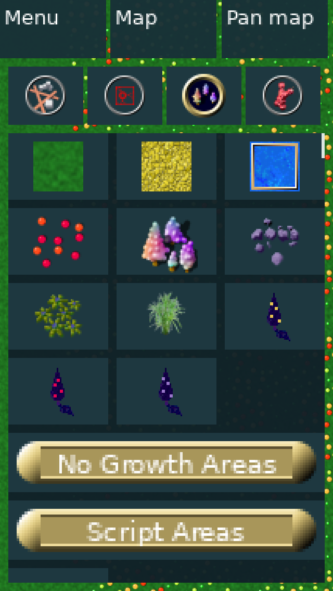
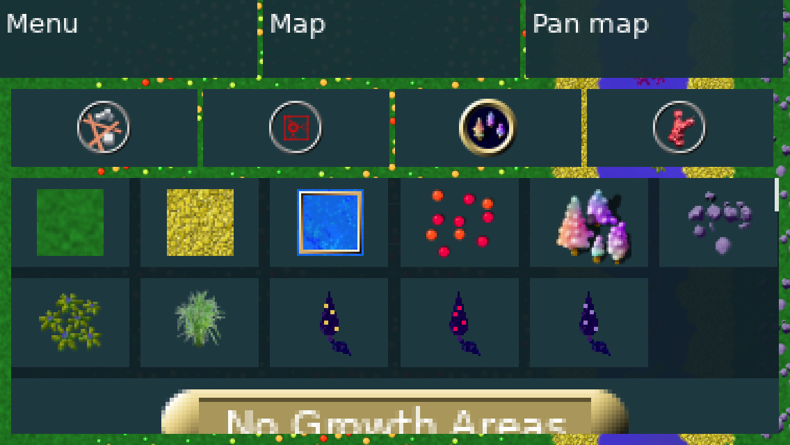

Corrected Android emulator captures (default text size):

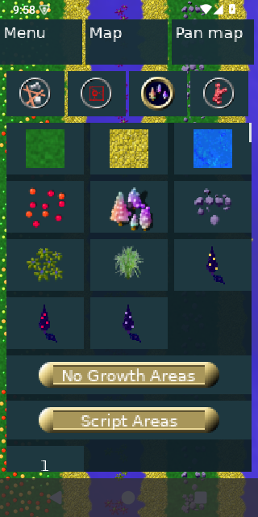
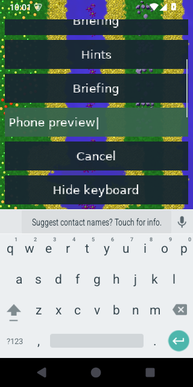
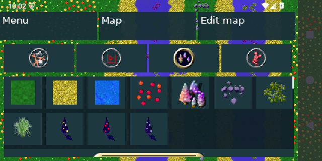

The refreshed `build/mobile-preview` bundle contains the current signed APK,
matching symbols, commit provenance and SHA-256 checksums. The older preview is
preserved under `build/mobile-preview-history`.

Physical Pixel 6/iPhone/iPad qualification, translation/bidi and assistive-technology
review remain release gates. Pinch zoom and main/system-menu visual redesign stay
outside this implementation scope. The older sections below describe historical
checkpoints and must not be read as the current list of unimplemented screens.

## Resumable replay saves

This checkpoint follows committed/pushed settings/results work `f4f397837`.
Save Replay now opens a child screen on the shared host stack, so the results
session survives cancellation, resize and asynchronous browser persistence.
Native phones use the existing form presenter, including filename input and
keyboard dismissal. Write and persistence failures stay visible for retry;
errors scroll to the top while OK/Cancel remain reachable.

Replay writes use checked atomic replacement, preserving the existing destination
on failure and restoring the live buffer position for retry. Exact-length copying
also fixes a dropped final byte when exporting an unfinished in-memory replay.
The replay format version is unchanged; reader regression checks pass.

Fresh verification:

- Native touch harness passes at 320×568 and 568×320, 100% and 150% text:
  results-to-save navigation, cancellation, empty names, backgrounded held input,
  failed writes, visible error rows, retry and readable saved replays.
- Engine-session checks pass with all three checksums still `7e7f31de`.
  Savegame-safety checks pass, including malformed/truncated input rejection.
- Wasm release, Android ARM64 release/developer signing, and iOS ARM64 simulator
  release builds pass.
- Browser replay/viewport tests passed 24/24 across Chromium, Firefox and WebKit.
  The final replay-only run passed 9/9 on the final Wasm build: cancellation,
  delayed persistence with resize, quota/aborted-transaction failures, retry and
  replay digest verification after reload.

Logs: `build/mobile-replay-final-{touch-build,touch,session,web,browser}.log`,
`build/mobile-replay-save-safety.log`, `build/mobile-replay-browser.log`, and
`build/mobile-replay-{android,android-sign,ios}.log`.
These failure captures are native harness fixtures at 150% text, not device tests:

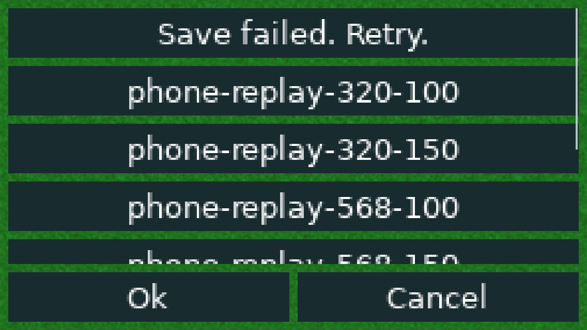
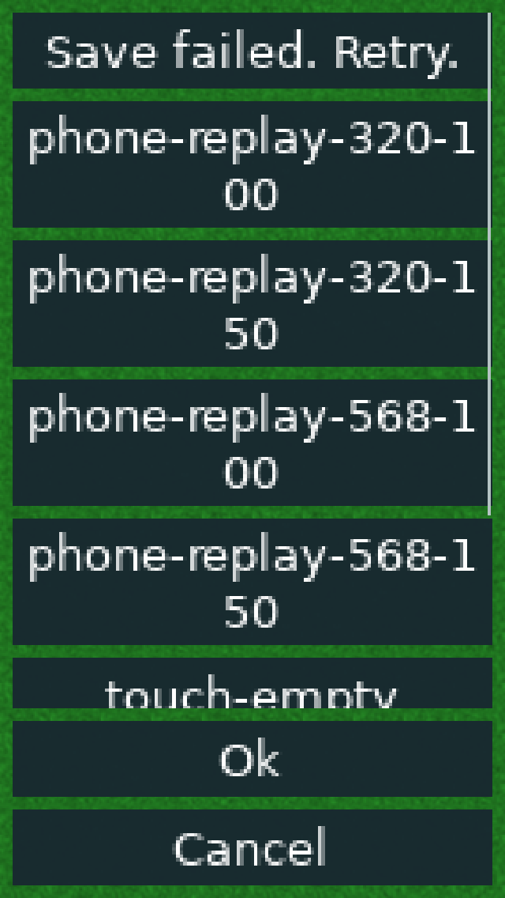

No new replay-specific emulator or physical-device qualification was performed.
The signed APK is rebuilt in the Android output directory; `build/mobile-preview`
is unchanged. Specialized editor touch UI, broader results/device qualification
and accessibility review remain open. Browser head `4051adb4d` was inspected but
not merged; the tested base remains `9dc201436`.

## Resumed global settings and results screens

Committed checkpoint `f4f397837` follows rebased HEAD `4a1b9bea8`. It adapts global
settings tabs and end-of-match results to the native phone presenter. Settings
retain the original language, audio, speed, building-default and keyboard
callbacks, with fixed OK/Cancel actions. The phone host's display configuration
is not exposed as desktop resolution/fullscreen/backend controls. Slider callbacks
receive the actual clamped widget value; game speed uses its formatted multiplier.
Results include a scalable graph, touch inspection, colored team rows, statistic
choices and fixed Quit/Save Replay actions. Long statistic labels wrap outside the
graph instead of clipping through its left edge at enlarged text sizes.

Fresh verification on the rebased working tree:

- Native touch harness passes at 320×568 and 568×320 with 100% and 150% text.
  Settings checks cover mute, speed changes and both limits, building-default
  controls, tab switching, touch-initiated SDL key capture and cancellation.
  Results checks cover graph touch, statistic selection, team toggling, unchanged
  simulation checksum and Quit reachability.
- Engine-session/editor persistence, screen lifecycle and portable-renderer
  harnesses pass. The three 50-tick session checksums remain `7e7f31de`.
- Wasm release builds successfully. Android ARM64 release builds and passes
  developer signing/alignment verification.
- The ARM64 iOS simulator release application rebuilds successfully after the
  browser rebase. This pass does not add iOS simulator launch or device evidence.
- All 27 browser viewport/settings-storage cases pass across Chromium, Firefox
  and WebKit when including one unchanged isolated rerun. The first run passed
  26/27; Firefox's quota-retry case timed out in `loading` while iOS compilation
  and emulator cold boot were competing for CPU. With compilation paused and the
  emulator stopped, that case passed in 18.7 seconds (21.4 seconds including
  startup). This suggests load sensitivity, not a demonstrated functional fix.
  The occupied default HTTP port was avoided with a task-owned ephemeral server.
- The signed Android app installs and launches in the isolated API 35 emulator.
  Settings tabs and scrolling work; two Swarm increment taps change its default
  from 4 to 6, and Cancel/reopening restores 4. Landscape rotation preserves
  usable controls and fixed OK/Cancel actions. The emulator's cold boot displayed
  a System UI ANR; selecting Wait recovered. This is not app-crash evidence.
  Rotation was restored and the isolated emulator was stopped after checking.

The initial native build exposed a test fixture using newly private TeamStats
history; it now generates history through the public API. The expanded shortcut
test needed a larger scroll traversal budget. Test captions are copied before
the presenter rebuilds its rows, avoiding a dangling reference in the helper.

Logs: `build/mobile-resume-{native-build,touch-rebuild,touch,session,screen,renderer,web,android,android-sign,android-install,browser,browser-rerun,ios}.log`.
The captures below are native harness renders at 150% dialog text, not real
matches or device evidence. The statistics fixture has zero building counts.

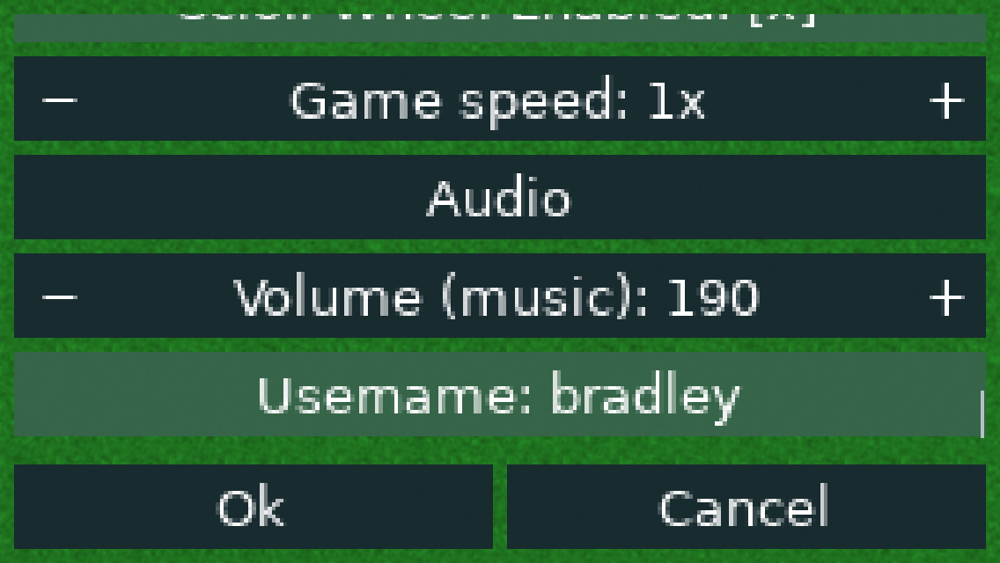
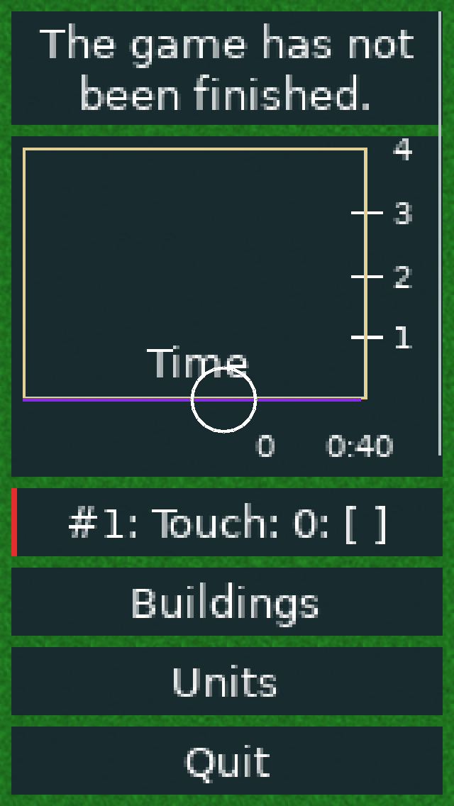

Fresh API 35 emulator captures (default dialog text):

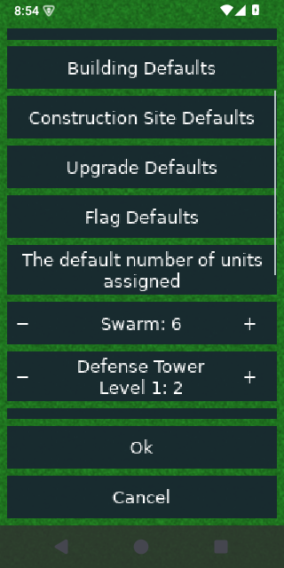
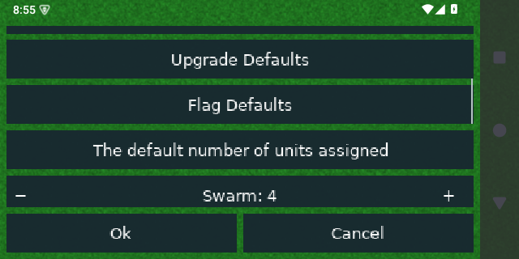

The existing `build/mobile-preview` APK still identifies pre-rebase source
`4345f28e0`; it has not been replaced by these working-tree changes. Full editor
adaptation, physical-device qualification, software-keyboard shortcut editing,
complete result/replay-save flows, translation/bidi/accessibility review and the
foundation/device gates below remain open. Pinch zoom remains deferred.

## Phone forms and adjustable dialog text (`4345f28e0`)

- Campaign/tutorial, map choice, custom-game options, map creation, AI description
  and message screens use a native phone presenter with wrapped, scrollable rows.
  Buttons and numeric controls retain at least 48-point targets. Existing widgets
  and callbacks own state; desktop/browser presentation remains unchanged.
- In-game Dialog text size offers 100%, 125%, 150%; the setting also applies to
  phone forms. Variable-height dialog rows account for wrapped labels, and large
  footer groups preserve a reachable final action instead of covering content.
- Shared safe-area/keyboard geometry is used by native forms, menus and gameplay
  dialogs. Held form input is canceled on viewport resize. Floating iPad keyboards
  no longer reserve a full-width bottom strip.
- Native touch tests pass at 320×568 and 568×320, 100% and 150% form text. Coverage
  includes campaign cancellation, player toggle rules, AI selection, map dimensions,
  ratio limits and conditional visibility, and resize cancellation. Shared engine
  session/editor persistence tests pass.
- Android ARM64 developer release builds, signs, installs and launches on the
  isolated API 35 emulator. The tutorial chooser, software keyboard/name editing,
  Hide keyboard, mission preview, tutorial launch and in-game text-size selection
  were exercised. This is emulator evidence, not Pixel 6 qualification.
- iOS ARM64 simulator and Wasm release builds pass. Floating-keyboard behavior
  remains unqualified on an actual iPad. All 15 browser viewport checks pass
  across Chromium, Firefox and WebKit on the final source (1.5 minutes).
- PR #202's visual refresh was inspected but not imported: it does not provide
  phone form reflow. This pass retains existing game art and styling foundations.
  Pinch zoom remains deferred to the zoom PRs.

Final logs: `build/ui-accessibility-qualified-touch.log`,
`build/ui-accessibility-qualified-session.log`,
`build/ui-accessibility-qualified-web.log`,
`build/ui-accessibility-qualified-browser.log`,
`build/ui-accessibility-footer-android.log` and
`build/ui-accessibility-footer-ios.log`. The refreshed `build/mobile-preview`
APK/symbols/BUILD.json/checksums identify code `4345f28e0`.
An initial browser run overlapped a build rewriting its served HTML and failed;
verification was rerun after the build completed. The final run passes all 15.

Emulator captures (API 35, 320×640, default dialog text):

Remaining UI scope: the specialized map-editor workspace, global settings tabs,
end-of-match/statistics presentation, full translation/bidi/accessibility review,
and physical-device safe-area, keyboard and rotation qualification. This update
improves the path into gameplay; it does not complete the full mobile UI plan.
See [implementation notes](development.md#responsive-native-forms-and-dialog-text).

## Pixel 6 feedback preview (`b8c0a46f6`)

- Inspector tabs reflow into at most three columns, retaining 48-point row targets
  and readable captions in both orientations.
- Native touch tests pass for repair/upgrade initiation and loaded replay
  pause/speed controls. Healing cannot change a held Repair into Upgrade.
- Android ARM64 release rebuilt, developer signed, installed and launched on the
  isolated API 35 emulator. Tutorial gameplay, filename entry with the software
  keyboard, fixed dialog actions, Hide keyboard and save submission were checked.
- Wasm and iOS simulator release builds pass; 15 browser viewport checks pass
  across Chromium, Firefox and WebKit after these changes.
- Emulator reload testing exposed a shared USL garbage-collection lifetime bug.
  The fix clears persistent root marks between collections and marks live thread
  frames. A regression exercises 100 collections with a retained bridge value;
  the corrected APK successfully reloads the tutorial save from both the main
  menu and the running game. The same process remains alive and gameplay continues.
- All nine focused browser tutorial restart, background-input and persisted
  save/reload tests pass across Chromium, Firefox and WebKit after the GC fix.
- The Android emulator also verifies readable Actions tabs in the live match.
- See [device testing](device-testing.md) for the Pixel 6 installation and feedback
  route. No physical-device performance, thermal or complete-flow qualification
  is implied by this preview. The emulator showed a System UI ANR during cold
  boot before testing; it recovered after Wait. This is not game crash evidence.

## Resumed qualification (`89bea4560`)

- Explicit Info tab preserves building details alongside Actions.
- Held actions are canceled when the building/construction state changes.
- Native touch tests pass for ratios, clearing/flag controls, destruction and
  cancellation in both phone orientations; merged engine-session tests pass.
- New translation captions load correctly after repairing key/value pairing.
- All 30 browser viewport, shutdown-storage and campaign-editor-storage tests
  pass across Chromium, Firefox and WebKit after the merge/catalog correction.
- Wasm release and ARM64 iOS simulator builds pass. The current iOS application
  was installed and launched in the isolated iPhone 16/iOS 26.5 simulator; a
  captured main menu confirms startup only, not in-game/keyboard qualification.
- Android ARM64 release APK builds and passes developer signing with current Java/JNI/manifest changes after
  refreshing verified dependencies. This does not establish emulator/IME behavior.
- Visual inspection still finds awkward narrow-tab wrapping. Real keyboard,
  replay and live mobile qualification remain open.

## Broader UI handoff checkpoint (`f69f21b42`)

Read [HANDOFF.md](HANDOFF.md) before continuing. This expands building Actions,
in-game dialogs, menu actions, replay controls, and keyboard/inset handling.
The native gameplay-touch harness builds and passes, including options, objectives,
filename text entry, save cancellation, and chat in both phone orientations.
The Wasm release and ARM64 iOS simulator application builds also pass for this
checkpoint. Browser runtime suites and simulator launch were not repeated.
Android changes and replay/Actions-sheet behavior still need the targeted tests
and device runs listed in the handoff. **The in-game UI is not finished.**

These are native regression captures, not emulator/live-match evidence. The
following older evidence remains scoped to the commits identified in each section.

## Current evidence

| Area | Evidence | Limit |
| --- | --- | --- |
| Desktop and browser | Native macOS release and Wasm release builds pass | Other desktop platforms not rebuilt locally |
| Android ARM64 | Release APK packaged, alignment checked, developer signed, installed and launched on API 35 ARM64 emulator | No physical device qualification |
| Android ARMv7 / x86-64 | Release APK builds, ELF/package alignment checks, and developer signing pass | No launch evidence on these ABIs |
| iOS device / simulator | ARM64 simulator and unsigned device apps build with matching dSYMs; simulator install, main menu, tutorial, touch selection, rotation, and retained-session resume pass | Signed physical-device installation and iOS 15 hardware remain unverified |
| Shared lifecycle | Native screen/session/renderer harnesses pass; Android retained-activity background/resume exercised | Killed-process and multiplayer recovery unfinished |
| Native touch and viewport | Responsive-menu and gameplay-touch integration harnesses pass; Android tutorial selection, placement, confirmation, rotation cancellation, and pan exercised | Complete phone panels and editor touch parity unfinished |
| Browser compatibility | 39 focused viewport/storage/import/protocol cases pass across Chromium, Firefox, WebKit after the latest merge | Not mobile Safari/Chrome device qualification |
| Build tooling | 21 Python checks pass, including invalid identities, archive alignment, signed APK provenance, fail-fast iOS requests, and explicit simulator device-set routing | Does not prove iOS linking or IDE debugging |
| CI | Android ABI matrix now packages, checks alignment, signs developer APKs, and collects symbols/diagnostics | Updated workflow has not yet been run; no automated emulator or iOS simulator gate |

The three native 50-tick engine-session variants agree on `7e7f31de` after
background and child-screen interruption. This is a lifecycle regression result,
not the requested 100,000-tick ARM/Wasm determinism qualification.

On the earlier `017d5b437` browser base, native renderer, screen lifecycle, gameplay touch,
and engine-session harnesses pass. In the browser run, 13 of 15 cases passed on
the first attempt. Two Chromium WebGL2 cases timed out on slow simulation progress
while iOS compilation and runtime setup were active; both passed unchanged in an
isolated rerun (30.4 seconds). The earlier browser-base storage evidence is not a
substitute for full post-merge storage qualification.

## Prior browser synchronization (`6d1d8bbae`)

Merge `d6f754dd5` incorporates browser head `6d1d8bbae`: validated imports,
campaign backup/recovery, durable editor save completion, and symmetric YOG
protocol admission. Both independent GameGUI members were retained when
resolving the merge conflict; mobile touch ownership and import preference
isolation remain separate.

After this merge, native gameplay-touch, screen, renderer, engine-session,
transport and savegame-safety harnesses pass. Save tests include imported-file
validation and pending/failure/retry cleanup, campaign backup validation and
atomic failure preservation. All three session checksums remain `7e7f31de`.
Desktop, Wasm and ARM64 iOS simulator application builds pass. All 39 focused
browser cases pass across Chromium, Firefox and WebKit: viewport changes, map
import, campaign progress backup merging, editor quota/transaction failures,
and symmetric protocol admission/incompatible-version rejection. Logs are
`build/allocation-merged-{native-tests,browser-tests,desktop,web,ios}.log`.
This pass does not add
Android packaging, simulator launch, or physical-device qualification.

## PR #198 layout integration

The layout foundation from #198 (`befa80298`) is selectively ported; see the
[architecture notes](architecture.md#shared-resizing-foundation-from-pr-198)
for retained mobile/browser behavior and exclusions. Verification for this port:

- 173 CppUnit tests pass, including editor anchors across phone/tablet widths.
- Native screen lifecycle, SDL renderer, responsive-menu, and gameplay-touch
  harnesses pass. Screen checks now cover layout before input/paint and dialog
  clamping, centering, and oversized origins.
- Wasm release build passes. All 15 viewport cases pass across Chromium,
  Firefox, and WebKit (56.1 seconds), covering menus, running matches, editor
  dialogs, minimum viewports, and high-density displays.
- ARM64 iOS simulator release app and dSYM rebuild successfully. The first
  packaging invocation could not find CMake on PATH; selecting the existing
  task-local CMake with `--cmake` completed the build.

The simulator was not booted again and Android/device builds were not rerun for
this port. Existing screenshots and device evidence predate these layout changes.
This does not yet address the legacy gameplay canvas's small phone text.

## In-game HUD verification

Native renderer, screen lifecycle, and gameplay-touch harnesses pass. New checks
cover UI transform clipping/restoration, enlarged panel selection in 320×568 and
568×320 windows, scrolling without camera movement or game orders, minimap centering against the
phone world viewport, and tutorial
scrolling versus acknowledgment. The retained simulation checksum is unchanged
by these UI actions. Twelve mobile build-tool tests pass. All 15 browser viewport
cases pass across Chromium, Firefox, and WebKit; Wasm and iOS simulator release
builds pass. The simulator app installs and launches on the isolated device.
Android packaging/device qualification has not been repeated for this change.
Simulator launch was checked before the final minimap-centering adjustment; the
final simulator app was rebuilt afterward. The isolated simulator was shut down
after checking launch as its retained caches left roughly 1 GiB free on the host.
The separate iPhone 17 simulator session was not changed.

These screenshots are **native regression-harness captures**, not emulator or
live-match qualification. The fixture reveals terrain explicitly and has no
initialized colony counters. It exercises real game drawing and touch dispatch.
They do not demonstrate iOS safe-area behavior or real-device performance.

See [in-game HUD architecture and limitations](architecture.md#in-game-phone-hud).

## Worker allocation and pause-menu verification

Native gameplay-touch, screen lifecycle and portable-renderer harnesses pass.
New phone tests exercise rapid worker taps, exact queued gid/count values,
authoritative checksum preservation, zero/maximum no-ops, selection-change
cancellation, and dragged-versus-tapped Return buttons in both orientations. Device-switch
tests prevent stale mouse/touch menu coordinates from activating an action,
including a two-finger sequence while switching back to touch.
The Wasm and ARM64 iOS simulator application builds pass, along with all 15
browser viewport cases across Chromium, Firefox, and WebKit.

The captures below are native regression fixtures, not emulator screenshots.
They include a test building and revealed terrain, with no live colony counters.

The iOS archive step exhausted temporary disk space. Failed simulator archives
and stale iOS **device** objects/core archive were removed and regenerated as
needed; source, SDKs, packaged device app, symbols, and captures were preserved.
The next device rebuild will recompile its core. No simulator boot or Android
packaging run is claimed for this change.

## Priority and flag range controls

Commit `433a03f08` adds fixed 48-point inspector tabs and controls. Priority
shows low/medium/high choices with pending selection feedback; flags expose
range minus/plus controls. The 96-point header stays visible while details scroll.
The existing game orders, type-specific range limits, and translated labels are
shared with desktop controls. Production ratios, flag resource/level controls,
and remaining in-game dialogs still need dedicated phone layouts.

After merging browser settings persistence (`46a4d56d0` in `b92c89935`), native
phone-touch, engine-session and savegame-safety checks pass, including exact
priority/range orders, no-ops, selected-building cancellation, settings completion,
and prior preference/keyboard file preservation on failure. The three session
checksums remain `7e7f31de`. Desktop, Wasm and ARM64 iOS simulator builds pass;
all 27 browser viewport/settings-persistence cases pass across Chromium, Firefox
and WebKit. Logs are `build/priority-merged-*.log`. Android packaging, simulator
launch and physical-device qualification were not repeated in this pass.

The captures are native phone-size test fixtures, not emulator or live-match
qualification. They expose terrain and test buildings without live colony counts.

## iOS simulator screenshots

Captured on an isolated iPhone 16 / iOS 26.5 simulator. The game reaches its main
menu and a running tutorial, selects units/buildings, rotates, and resumes the
same process after Home/backgrounding. No device signing credentials were used.

The screenshots expose remaining layout work: status bar/notch overlap with the
legacy HUD, small legacy dialogs/panels, and missing touch tutorial instructions.
These are not claims of complete phone usability. The simulator's first boot took
about two minutes. Runtime registration required `simctl runtime scan-and-mount`;
a duplicate record referred to the same runtime image and was left intact.
First-boot caches exhausted most remaining host disk space. After verification,
the isolated simulator was shut down and rebuildable iOS dependency intermediates,
cached Android installers, and the optional exported runtime copy were removed.
Apps, core/dependency libraries, matching symbols, device data, logs, and screenshots
remain. Approximately 3.5 GiB was free after cleanup; more headroom is needed for
further clean builds or additional simulator devices.

## Android emulator screenshots

Captured on the API 35 ARM64 emulator on 2026-09-08, using runtime commit
`7333e4e8b`. These are existing captures from the touch/viewport smoke test.
Dark world regions are unexplored terrain; legacy panels and tutorial text still
need phone reflow. These screenshots establish functional rendering, not device
performance or iOS support.

Portrait placement preview with the explicit Confirm/Cancel strip:

Portrait after confirming construction through the shared game order:

Landscape after rotation cleared the placement gesture (confirmation disabled):

## Reproduction artifacts

The [developer guide](development.md) contains build and regression commands.
Local ignored artifacts in the mobile worktree include:

- `build-touch-fullscreen-tests.log`: native renderer, screen, menu, touch, session checks.
- `build-touch-fullscreen-browser-tests.log`: nine browser checks.
- `build/touch-fullscreen-*.png`: Android portrait/landscape, selection, placement and pan captures.
- `build-ios-tool-tests.log`: 21 build-tool checks.
- `build-ios-simulator-final.log`, `build-ios-device-final.log`: successful app builds.
- `build-ios-native-test-results.log`: merged native regression results.
- `build-ios-browser-tests.log`, `build-ios-browser-rerun.log`: browser results and reruns.
- `build-ios-boot.log`, `build-ios-launch.log`, `build-ios-resume.log`: first boot and same-process resume.
- `build/ios-app-data-path.txt`: isolated writable container location.
- `build-foundation-armv7.log` and `build-foundation-x86_64.log`: current ABI packaging runs.

Release developer APKs live under
`build/android/device/<abi>/26/client/release/android-project/app/build/outputs/apk/release/`.
Signing keys remain local and are not CI artifacts. CI uses runner-provided SDK
packages and Java 17 alongside the pinned NDK and Gradle; a fully archive-pinned
Linux JDK/SDK bootstrap remains to be completed.

Both iOS binaries identify their correct platform (IOS versus IOSSIMULATOR),
minimum OS 15.0, and SDK 26.5. Their dSYM UUIDs match. The generated Xcode project
keeps build caches in its target output; Apple manages Xcode and runtime storage
system-wide, and simulator device data stays in `build/mobile-tools/ios-simulators`.
No physical-device signing identity or provisioning profile has been qualified.

## Next foundation gates

1. Qualify locally signed iOS physical-device installation and address iOS safe-area,
   status-bar, and keyboard occlusion in the shared UI integration.
2. Run Android CI packaging and launch checks on the remaining ABIs; add automated
   emulator/simulator startup, lifecycle, and asset-path checks with diagnostics.
3. Finish incremental modal/lifecycle coverage and durable native storage before
   relying on background or process recovery. Qualify graphics restoration on devices.
4. Verify IDE native debugging, release symbols, sanitizer support, and profiling;
   complete host toolchain pinning and reproducible clean-build evidence.

Pinch zoom is explicitly deferred. Further phone panel/editor reflow, browser touch
integration, native system WebSockets, coordinated network recovery, transactional
saves, import/export, and full mobile-browser support remain planned work.
Do not claim the full six-milestone mobile delivery is complete.

## Device qualification still required

The target is iOS/iPadOS 15+ ARM64 and Android 8+ ARM64/ARMv7, including 2 GB devices.
Required hardware includes a first-generation iPhone SE or equivalent, a 2 GB
Android 8 ARMv7 device, modern Android ARM64, and iPad. Emulation is insufficient.

The fixed 128×128 four-player late-game fixture must sustain 25 simulation ticks/s
and at least 30 rendered frames/s for 30 minutes below 500 MiB peak process memory.
Newer hardware targets 60 FPS. Cross-architecture 100,000-tick checks, mixed-platform
multiplayer, thermal/audio interruption, browser eviction, and storage fault tests
remain unqualified. Larger maps must load or fail clearly without changing rules.

The emulator displayed a System UI nonresponse dialog during concurrent compilation
and recovered with Wait. No device performance conclusion follows from that run.
Voice chat, cloud saves, store submission, and new visual identity remain deferred.
