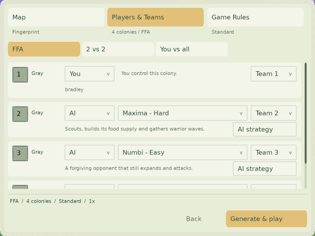
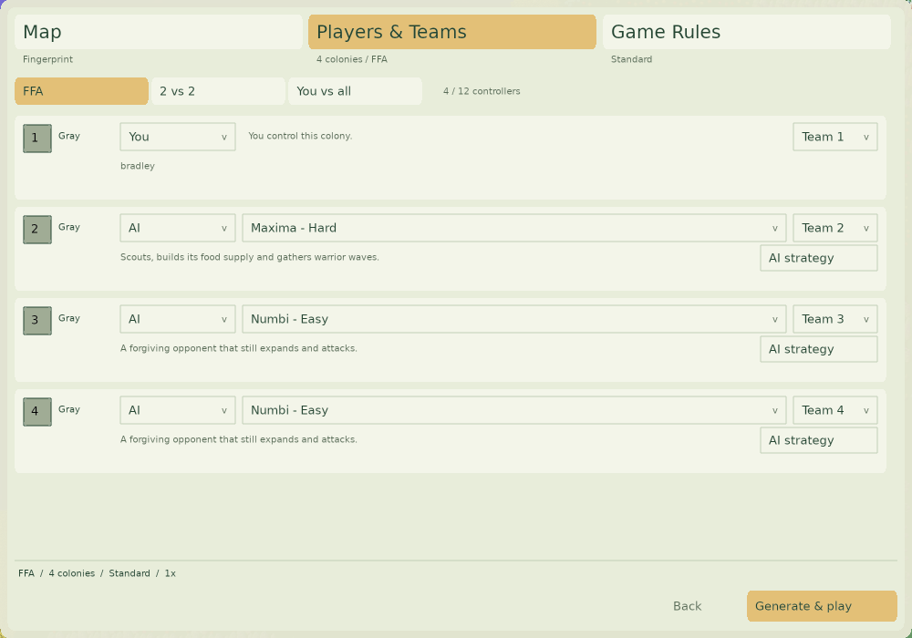
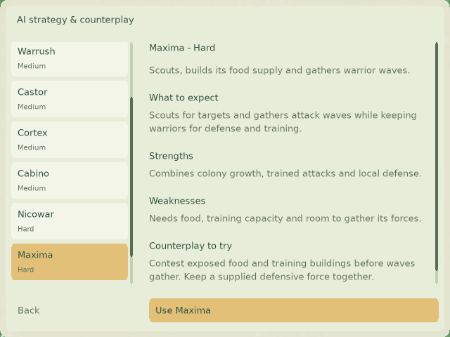
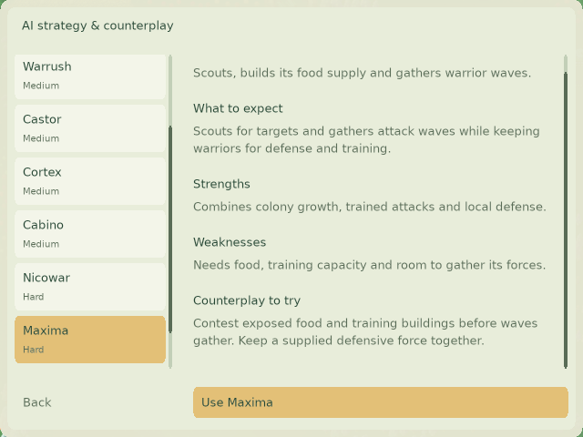
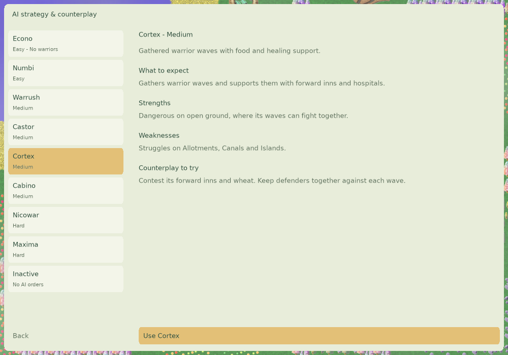

# Player-facing AI strategy evidence

Source reviewed: `d37c0c353` (master, including Maxima fixes #367 and #368).
Results analyzed: all 20,000 accepted games from the completed source `f2cfcfeb05b39cc17eab43a532ebb551172de8de` cohort, comprising two disjoint 10,000-game batches. These are 128×128 duels across 60 generators, 10,000 swapped-side seed pairs, 90,000-tick cap, prestige adjudication and probability victory disabled. Failed map requests and preflights are excluded. The earlier arena-only experiment is not representative of this distribution and supplies no profile claims.

The user requested concise gamer-facing copy, with all analysis and methodological detail kept outside the game.

The new d37 Maxima tournament is still running. Its unfinished outcomes are not used to rank map weaknesses: fast-finishing games would be overrepresented. Do not pool the two Maxima versions. The other seven AI implementations are unchanged, but their cohort includes old-Maxima matchups; the provenance remains explicit here, outside the game. Refresh this analysis on the completed new cohort alongside PR #364's ratings before treating the profiles as current-version findings.

## Method and artifacts

`outcomes.json.gz` contains every accepted game; `catalog.json` supplies the frozen generator catalog. `patterns.json` contains all 648 AI/generator or AI/tag comparisons, including sample sizes, cap rates and cap-as-draw sensitivity. Score is wins plus half draws, not necessarily conquest. Residuals subtract each AI's empirical opponent/build score rate. Two thousand permutations shuffle complete paired blocks within opponent/build strata. Joint maximum-statistic adjustment covers all tested cells. Tags overlap and describe generator families; they do not establish causal terrain effects. The source revision is frozen in the script.

`batch-check.json` compares both 10k batches separately. Repeated directions strengthen the descriptive evidence but are not claimed as independent confirmatory significance tests. Some examples were selected after examining both batches. Individual map samples are only about 82–84 games per AI.

Reproduce from repository root (Python standard library):

```sh
python3 docs/validation/ai-strategy-profiles/analyze.py --repository .
python3 docs/validation/ai-strategy-profiles/check_batches.py
```

## Claims used in the profiles

| AI | Completed-cohort observations used | Implementation cross-check |
| --- | --- | --- |
| Warrush | Caravanserai 83.3%, Tidal Flats 75.0%; river-tagged score 8.6 percentage points below opponent/build baseline | `src/ai/AIWarrush.cpp`: early attack allocation, constrained inn expansion, exploration flags. Protecting food/birth infrastructure is advice, not a proven cause of wins. |
| Cortex | Wide-open family +7.4 pp; Allotments 7.3%, Canals 25.0%, Islands 26.8%; lake family +6.1 pp | `src/ai/cortex/CortexPolicyCombat.cpp`: cohesive waves, forward inn before hospital. No blanket “water weakness” claim. |
| Cabino | Hidden Oasis 29.8%, Canals 41.7%; Contested Commons and Plantations below baseline | `src/ai/AICabino.cpp`: `PrioritizedBuildingAttack::attack` waits for barracks and trained available forces; defense and construction modules. Removed author-centric department explanation and unmeasured claims about reaction speed. |
| Nicowar | Tidal Flats 47.6%, Hedgerow Country 50.0%; negative residual in both batches | `src/ai/nicowar/Phases.cpp`, `Attack.cpp`: population, training and war-readiness gates. Removed unquantified “huge armies” assertion. |
| Castor | Rice Terraces 1.2%, Hills 2.4%; Contested Commons 42.7% (+18.7 pp over its baseline); lower overall rating | `src/ai/castor/GetOrder.cpp`, `Control.cpp`, `Projects.cpp`: growth, upgrade and combat planning. Removed unsupported scarce-resource advantage. No causal placement diagnosis from outcomes alone. |
| Numbi | Allotments 53.6%; Hills and Hedgerow above its baseline; lowest overall fitted rating | `src/ai/AINumbi.cpp`, `AINumbiEconomy.cpp`: colony/building and birth allocation. “Gentler” describes relative cohort results, not safety from attacks. |
| Econo | Carousel 69.0%, 66.7% capped; +41.0 pp residual drops to +16.1 pp with caps scored as draws. Contested Commons 72.0% | `src/ai/echo/Econo.cpp`, `EconoFlags.cpp`, `EconoBuilding.cpp`: worker/explorer births, fruit and enemy explorer flags; no warrior production. `src/team/TeamRouting.cpp::findNearestFood` compares available food happiness, supporting fruit access as a counterplay suggestion. Does not claim a conquest advantage. |
| Maxima | No old map weakness promoted as a current-version fact; current copy describes its food/training/assembly needs without a performance claim | `src/ai/maxima/AIMaximaCombat.cpp`: offense estimates, defense/training reservations, open-ground wave assembly; `AIMaximaRecon.cpp`: sightings and scouting; #368 army-capacity fix. Replaces inaccurate “attacks without pause, sending every warrior” description. |

All map claims above pass the combined exploratory adjustment. The in-game copy contains no percentages, tournament references or methodology. All numbers remain in this evidence document and its artifacts. Cross-checking code supports what orders the player may encounter; it cannot turn a result correlation into a demonstrated mechanism. The “Counterplay to try” advice is inferred from implementation and observed results; it has not been tested against humans. End-of-game building totals cannot determine first building destruction, and population totals cannot distinguish workers from army growth; those abandoned exploratory questions are not used here.

## UI and localization

The 44×18 quiet Info link becomes an outlined 128×28 **AI strategy** button. Rows reserve room for it and their summaries at narrow and wide sizes. Maxima gets the missing Summary and Profile keys. All eight profiles and short descriptions are rewritten around player expectations and concise strengths, weaknesses and counterplay. Superseded translations fall back to the updated English text until translated; existing translation history remains in Git. No simulation, saved AI identity or rating values change in this PR.

Keep this PR open for discussion; do not merge automatically.

## Refresh with the next completed cohort

Keep version cohorts separate. When the new Maxima results are complete, rerun the map analysis on all its accepted paired outcomes using the same 60-generator catalog and the corresponding source revision for tags. Review whether each qualitative strength/weakness still holds, including cap-as-draw sensitivity. Revise simple in-game text only where the new evidence supports it; do not embed statistics or research notes in the game. Keep actual Elo numbers in #364 and all supporting results here. This profile PR can be reviewed independently, but coordinate its final evidence refresh with the rating update.

## Validation

- Optimized macOS client/harness build passed: [build log](build.log.gz).
- Existing custom-game regression passed: [log](regression.log).
- Every selectable profile and its scroll extent rendered at 640×480 and 1000×700 with no missing profile/summary key: [small log](profiles-small.log), [large log](profiles-large.log).
- All three full SDL launch flows passed, including the strategy button, nested choice, selected AI, controller modes and match launch: [interactive log](interactive.log). The test now selects by roster identity instead of assuming a fixed number of Down presses, matching the independent fix in #364.
- Language-key audit passed: all eight active AIs have unique registered Description/Summary/Profile keys in every language file, with populated English fallbacks.
- Visual inspection confirmed the labelled button, separated summary text, readable Maxima profile and reachable counterplay text. Four rows require scrolling at 640×480; all four fit at 1000×700.







These screenshots intentionally show master's existing labels; rating values and ordering belong to #364. Only UI/text and its harness changed, so no simulation equivalence claim is inferred from this validation. Windows/Linux builds have not been run locally for this UI change; CI remains to be checked.
