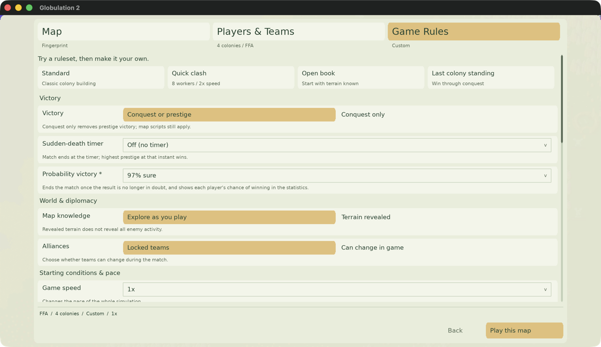
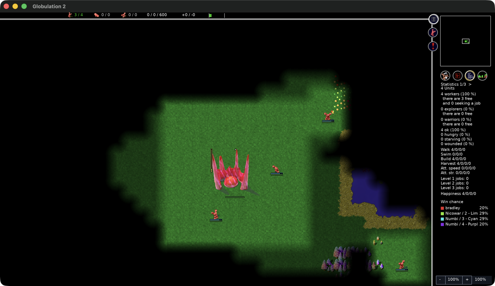

# The win probability model

Who is winning, while the game is still being played.

The [fairness model](map-generators/FAIRNESS_MODEL.md) asks who *started* best,
from the map alone. This one asks who is *ahead*, from the state of play, and it
is the same kind of thing fitted to the same kind of evidence: games whose
outcome we know, read at a point when the outcome was not yet known.

It is used three ways. The statistics screen shows it. An optional winning
condition ends a match once it is sure enough. And the tournament harness can
turn that condition on to stop playing out games that are already decided.

## What the model is

Every competitor still standing gets a fitness

    F_i = intercept + sum_k coefficient_k * transform_k(state_k(competitor_i))

and its probability of winning is `softmax(F)` over the competitors. Allies are
one competitor, because they win or lose together.

The fitted terms, in the order selection added them, which is also the order of
how much each one bought:

| Term | Reads | Coefficient |
| --- | --- | ---: |
| `units` (share) | its share of everyone alive | +2.610 |
| `prestige` | prestige | +0.022 |
| `barracks` (sqrt) | finished barracks | +0.380 |
| `explorers` (sqrt) | living explorers | +0.252 |
| `starving_ratio` | share of its people starving | −2.319 |
| `attack` (share) | its share of all attack strength | +0.459 |

One term per family, as in the fairness model: several readings of the same army
would each take a slice of the same credit and leave coefficients nobody can
read. Families here are army, economy, food, prestige, schooling, fortification
and exploration.

Two things stand out. Sharing most of the living population is worth far more
than any military term — this is a game you win by out-growing someone. And
starvation is the one strongly negative term: a colony whose people are dying
hungry is losing, whatever else it has.

### What the fitness does and does not mean

Softmax fixes the scale of `F` but not its zero, so the absolute level is a
convention and cancels between competitors. Only differences carry meaning. The
intercept is carried for reporting only.

The model is a *description of how these games went*, not a theory of the game.
It says that colonies with most of the population and no starvation went on to
win; it does not say that building barracks causes victory. A term can be a
symptom rather than a cause.

## Where the coefficients come from

1,110 games, sampled every 512 ticks, giving 131,630 training samples. The games
are a uniform random draw over all eight AIs, all three formats (1v1, 2v2,
free-for-all) and every map generator and size — the same campaign that produced
the AI ratings.

Each 512-tick sample is one contest: the surviving competitors are its entries,
their live state is the evidence, and the finishing order the game eventually
reached is the label. That is deliberately the same estimator the fairness model
uses (`tools/conditional_logit.py`), so there is one conditional logit in the
tree and two models on top of it.

Three choices matter:

- **Labels come from the end of the game, not the sample.** That is the whole
  point: what we want to predict at tick T is the result that only arrives later.
- **Games stopped at the tick cap are labelled by the same economic adjudication
  the ratings use.** Excluding them would drop the games that are hardest to
  call, which are exactly the ones this is for.
- **Cross-validation groups by game.** A game's ~130 samples are near-identical
  views of one outcome; splitting them across folds would let the fit see its own
  test set and report an accuracy nobody could reproduce.

Cross-validated, grouped by game: McFadden R² 0.413, top-1 accuracy 77.5%
against 42.9% for guessing.

### It is calibrated, and that is what matters here

A winning condition needs the number to mean what it says, not merely to rank
correctly. Held out by game, predicted and observed win rates:

| Predicted | 0.008 | 0.038 | 0.078 | 0.125 | 0.179 | 0.248 | 0.340 | 0.459 | 0.610 | 0.773 | 0.905 | 0.982 |
| --- | --- | --- | --- | --- | --- | --- | --- | --- | --- | --- | --- | --- |
| Observed | 0.006 | 0.027 | 0.054 | 0.096 | 0.158 | 0.238 | 0.357 | 0.500 | 0.639 | 0.783 | 0.908 | 0.979 |

The top bucket — where the threshold lives — reads 0.982 predicted against 0.979
observed. Broken out by phase of the game, predicted and observed agree to three
decimals in every one of five tick bands.

### The confidence ramp that was removed

An early lead means far less than the same lead at the end: measured over the
campaign, whoever *first* held the HP lead for five straight samples went on to
win only 40% of the time. So the model was fitted with an explicit ramp on game
age to stop it calling early leads.

The ramp was then removed, because it earned nothing. Fitted on cross-validated
log-loss it went nearly flat, and a model without it scored the same (0.5219
against 0.5220). The reason is that the selected features are absolute counts:
early on everybody has few units, the fitness differences are small of their own
accord, and the model is unsure without being told to be. The features already
carry the phase.

What the ramp turned out to be was a second confidence dial, redundant with the
decision threshold — fitting it to 1.0 and calling at 97% gives the same saving
and the same error rate as leaving it flat and calling at 95%. One dial is
enough, and the threshold is the one a player can read.

### What does not predict winning

Screened on its own, every candidate measurement against cross-validated fit:
`units` and `workers` lead, `hp` and `attack` follow. At the bottom, indis-
tinguishable from chance, are total **defense power**, **towers** and the
**warrior fraction** of the population. Defensive strength in particular is
worth about nothing as a signal — the team leading on it at the midpoint won
50.3% of the time.

## Why the arithmetic is all integers

The winning condition runs inside the synchronised simulation and decides the
outcome. Two machines that disagree by one bit would end the same game on
different ticks, which desynchronises a network game and diverges a replay.
Floating point cannot promise agreement across platforms, because `exp` and `log`
come from the platform's library.

So there is no floating point in the decision path:

- Selection was restricted to transforms with exact integer forms — identity, a
  division (`share`, `starving_ratio`) and a square root. `log1p` was excluded,
  and the emitter refuses to emit any transform it cannot do exactly rather than
  quietly falling back on an approximation. It cost nothing: selecting with
  `log` available scored 0.4160 against 0.4149 without it, and slightly worse
  accuracy.
- Coefficients are emitted twice — as a `double` for display and reporting, and
  as a fixed-point integer rounded **at generation time**, so the rounding is the
  fit's rather than a compiler's.
- The softmax uses a hand-rolled fixed-point exponential: the argument is reduced
  by whole multiples of ln 2 and the remainder evaluated as a fixed series, in
  integer add, multiply, shift and divide only. It agrees with `libm` to 6e-10.
- Scales are chosen so one 64-bit multiply per term cannot overflow given clamped
  inputs, which avoids 128-bit arithmetic and the portability question with it.

The features may only be things the simulation already maintains — `TeamStat` and
`Team::prestige`. The gameplay measurements and the per-AI telemetry are both
documented as diagnostic and must never influence play, so a model that decides a
winning condition cannot read them. Conveniently the `GLOB2_ECON` and `GLOB2_TL`
telemetry the fit is trained on is itself `TeamStat`-derived, so the training
features and the in-engine features are the same quantities.

`tools/win_probability_model.py` mirrors the same integer algorithm in Python, so
`test/test_win_probability_model.py` asserts the engine and the fitter agree
*exactly* rather than closely, against recorded engine output.

## Running it

```sh
# Extract the per-sample dataset from played tournament results (about 90s for
# a thousand games; the logs are tens of megabytes each).
python3 tools/win_probability_model.py dataset RESULTS_DIR --output dataset.json.gz

# What each candidate state measurement predicts on its own.
python3 tools/win_probability_model.py screen dataset.json.gz

# Select, fit, and regenerate src/WinProbabilityModel.h.
python3 tools/win_probability_model.py fit dataset.json.gz

# What the condition would have saved on games already played.
python3 tools/win_probability_model.py savings dataset.json.gz
```

Needs numpy and scipy for the fit; the arithmetic and the emitter do not.

Regenerating the header must be a no-op when nothing has been refitted, and a
test asserts it.

## The winning condition



Off by default. A normal game is unchanged: the model has no say in the outcome,
and the statistics screen does not even show it.

Turned on from the custom game rules, the match ends as soon as the model is
sure enough. It is evaluated on the 512-tick boundary `TeamStats` already samples
at — the cadence it was fitted on — and never before tick 5,120, since the
opening samples can look lopsided for reasons that mean nothing. It is placed
last among the winning conditions, so an actual elimination or prestige win is
always the reason a game ended when one is available on the same tick.

With the rule on, the statistics screen shows each side's chance under the
existing worker and food figures. Allies share one figure, because the model
rates the alliance. With the rule off the panel is not drawn at all: the model
has no say in a normal game, and putting a number on everyone's chances would
tell players something the match does not run by.



The threshold is the only dial:

| Threshold | Compute saved | Games ended on the wrong side |
| --- | ---: | ---: |
| 95% | 27.1% | 3.8% |
| **97%** (default) | **19.7%** | **2.3%** |
| 99% | 9.9% | 0.8% |

Measured over the 1,110 games, cross-fitted so no game is scored by a model that
saw it. The error rate sits inside what each threshold implies, which is another
way of saying the model is calibrated: at 97% it is wrong 2.3% of the time.

## What it saves, and why not more

Of the campaign's 103 core-hours, **63% went to games that never resolved** —
they ran to the 90,000-tick cap at an average of 402 seconds each, against 137
for a game the engine decided. Those are the obvious prize.

At 97% the condition returns about a fifth of the total: 25.8% of the compute
spent on games the engine decided, but only 16.9% of the compute spent on capped
ones.

That asymmetry is the honest headline, and it is not a defect to be tuned away.
Capped games hit the cap **precisely because nobody is winning**, so a model
asked whether the result is beyond doubt correctly answers no. A retrospective
probe that allows itself hindsight — the earliest point after which the eventual
winner never again loses the HP lead — puts the ceiling at ~43% of compute; a
threshold that has to decide in the moment, without knowing the future, reaches
about half of that. The remainder is not waste; it is genuine uncertainty.

## Limits

- The model was fitted on AI games only. Human play may distribute these
  quantities differently, and nothing here has been checked against it.
- It is fitted on the whole random draw, so it describes the average game across
  every generator and size rather than any particular map. Per-generator
  behaviour has not been broken out.
- It reads six numbers. Position, terrain, who is adjacent to whom and what is
  about to happen are all invisible to it, which is part of why a close game
  stays close in its eyes.
- `prestige` earns a place but a small coefficient, and prestige comes only from
  top-level schools; in matches where nobody builds them the term contributes
  nothing at all.
- The error rates above are measured against the *adjudicated* winner for capped
  games, so they inherit whatever the economic adjudication gets wrong.
- Refitting changes when games end. That is a gameplay change for anyone using
  the rule, and it invalidates comparisons with tournament results gathered under
  the previous coefficients.

## Related

- [The fairness model](map-generators/FAIRNESS_MODEL.md) — the same estimator, on
  starting positions.
- [Gameplay statistics](gameplay-statistics.md) — the diagnostic measurements,
  which this deliberately does not use.
- [AI telemetry](ai-telemetry.md) — per-AI internals, likewise excluded.
- [Distributed tournaments](tournaments.md) — where the games come from, and the
  `win_probability_permille` experiment setting that turns the condition on.
