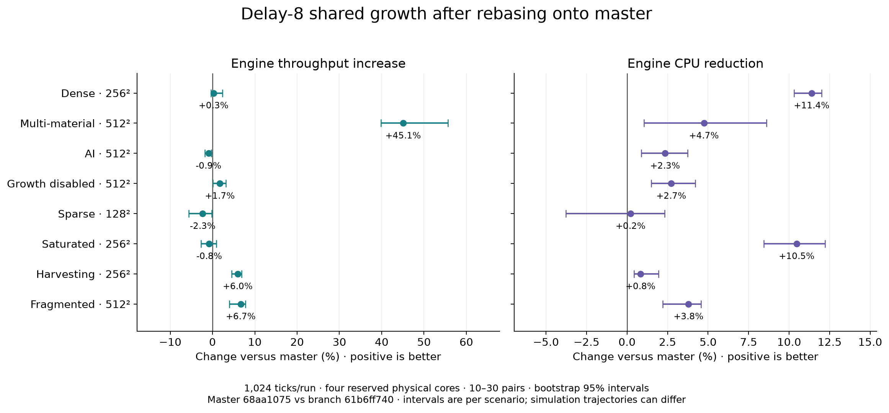

# Rebased delay-8 resource-growth performance

Branch `61b6ff7402d986ed364ac4484a97090d482c7a14` versus actual master `68aa1075b365efab78083fe5587051e689cb7ed1`. Shared growth, delay 8, four compute workers. Both engines include master’s scheduled building-gradient pipeline.

The gains survive, but this is not an across-the-board improvement. Multi-material throughput improves **45.1%** (95% CI **39.8%–55.6%**) versus master, saving a paired median **2.158 s per 1,024 ticks**. Dense and saturated throughput remain unresolved while CPU falls **11.4%** and **10.5%**. AI-heavy throughput falls **0.94%** and sparse throughput **2.32%**; harvesting and fragmented runs improve but have different simulated workloads.

Shared versus owner execution isolates a multi-material throughput gain of **8.79%** (CI **3.12%–12.91%**) at **4.28% more CPU**. Dense shared execution is **1.98% slower** than owner, with lower CPU. Therefore the full master comparison must not be described as a 45% threading speedup. The branch includes the contiguous-copy optimization too.

Several p99 ticks worsen **18%–40%**, and peak RSS rises about **50 MiB** in the multi-material fixture (**189→239 MiB**) and **14%** in fragmented stocks. This remains a draft with explicit performance tradeoffs, not an unqualified performance acceptance. Delay 8 and shared execution remain the requested defaults.

## Whole-engine results

Positive throughput/CPU reductions and positive saved milliseconds favor the candidate. Intervals are paired bootstrap 95% intervals for the median (100,000 resamples, fixed seed 713), not simultaneous intervals across all scenarios.

### master-vs-shared8

| Fixture | Pairs | Throughput gain % [95% CI] | CPU reduction % [95% CI] | Wall ms saved [95% CI] | CPU ms saved [95% CI] |
|---|---:|---:|---:|---:|---:|
| dense | 30 | +0.25 [-0.38, +2.31] | +11.39 [+10.30, +12.01] | +1.39 [-2.15, +13.25] | +243.31 [+217.85, +264.73] |
| multi | 10 | +45.07 [+39.82, +55.62] | +4.74 [+1.05, +8.61] | +2157.85 [+1730.95, +2379.63] | +676.01 [+180.77, +1211.13] |
| ai512 | 30 | -0.94 [-1.81, -0.31] | +2.35 [+0.87, +3.74] | -12.74 [-25.24, -4.18] | +105.84 [+38.59, +159.88] |
| disabled512 | 30 | +1.75 [+0.10, +3.15] | +2.73 [+1.50, +4.21] | +18.54 [+1.07, +34.04] | +90.27 [+48.09, +149.32] |
| sparse | 30 | -2.32 [-5.60, -0.19] | +0.22 [-3.76, +2.31] | -2.42 [-5.72, -0.20] | +0.89 [-13.24, +8.87] |
| saturated | 30 | -0.77 [-2.69, +0.92] | +10.46 [+8.44, +12.21] | -4.31 [-15.33, +4.88] | +217.98 [+174.42, +262.88] |
| harvested | 10 | +5.97 [+4.55, +6.84] | +0.83 [+0.44, +1.95] | +23.53 [+18.11, +27.17] | +11.17 [+5.94, +26.67] |
| fragmented | 10 | +6.68 [+3.94, +7.75] | +3.79 [+2.21, +4.56] | +182.13 [+108.66, +209.96] | +385.91 [+226.50, +459.31] |

| Fixture | Reference wall ms | Candidate wall ms | Reference CPU ms | Candidate CPU ms | p99 change % [95% CI] | RSS change % [95% CI] |
|---|---:|---:|---:|---:|---:|---:|
| dense | 567.21 | 562.52 | 2117.20 | 1896.35 | +26.96 [+24.70, +30.78] | +1.14 [+0.42, +2.03] |
| multi | 6261.21 | 4249.07 | 14359.71 | 13705.04 | -27.62 [-31.28, -20.10] | +24.36 [+22.88, +29.66] |
| ai512 | 1317.90 | 1333.97 | 4523.10 | 4385.04 | +22.85 [+16.39, +25.89] | +0.40 [-0.32, +0.64] |
| disabled512 | 1077.37 | 1060.19 | 3277.75 | 3174.80 | +1.20 [-2.49, +3.91] | -0.73 [-1.00, -0.39] |
| sparse | 103.66 | 105.90 | 363.39 | 363.96 | -1.23 [-10.20, +1.80] | +0.00 [+0.00, +0.00] |
| saturated | 555.67 | 560.99 | 2098.01 | 1892.30 | +26.56 [+20.67, +29.54] | +1.69 [+1.44, +1.78] |
| harvested | 419.65 | 397.11 | 1353.91 | 1340.57 | +17.80 [+13.89, +21.75] | -0.55 [-1.20, -0.26] |
| fragmented | 2908.38 | 2720.76 | 10159.05 | 9811.30 | +40.41 [+34.61, +45.67] | +14.42 [+10.84, +17.68] |

### owner-vs-shared8

| Fixture | Pairs | Throughput gain % [95% CI] | CPU reduction % [95% CI] | Wall ms saved [95% CI] | CPU ms saved [95% CI] |
|---|---:|---:|---:|---:|---:|
| dense | 30 | -1.98 [-2.92, -0.75] | +3.13 [+2.21, +4.92] | -11.01 [-15.66, -4.20] | +61.56 [+42.01, +97.08] |
| multi | 30 | +8.79 [+3.12, +12.91] | -4.28 [-5.47, -3.51] | +382.83 [+135.23, +589.29] | -621.57 [-747.03, -486.15] |
| ai512 | 30 | -0.40 [-1.46, +0.96] | -0.09 [-1.33, +1.66] | -5.47 [-19.82, +12.46] | -4.32 [-59.77, +72.13] |
| disabled512 | 30 | -0.25 [-2.24, +0.89] | -0.08 [-1.90, +1.54] | -2.55 [-23.95, +10.27] | -2.49 [-59.63, +49.02] |

| Fixture | Reference wall ms | Candidate wall ms | Reference CPU ms | Candidate CPU ms | p99 change % [95% CI] | RSS change % [95% CI] |
|---|---:|---:|---:|---:|---:|---:|
| dense | 555.70 | 566.04 | 1954.51 | 1902.27 | +12.83 [+10.32, +16.08] | -0.77 [-1.14, -0.59] |
| multi | 4731.60 | 4565.56 | 13636.15 | 14596.44 | -6.36 [-8.79, -4.50] | -7.04 [-7.32, -6.21] |
| ai512 | 1339.46 | 1335.14 | 4433.80 | 4408.27 | +11.89 [+9.23, +13.34] | -1.27 [-1.38, -1.04] |
| disabled512 | 1065.06 | 1066.50 | 3209.64 | 3209.69 | +2.14 [-1.65, +6.23] | -0.00 [-0.16, +0.27] |

## Tail latency, memory and attribution

These are whole-engine measurements. The branch retains the dense contiguous-copy optimization, and owner/shared controls isolate only growth placement. Snapshot capture and executor waits are overlapping elapsed timers; their changes explain where time moves but cannot be summed into a speedup decomposition.

| Fixture / variant | p99 ms | Peak RSS MiB | Capture ms | Gradient deadline wait ms | Growth deadline wait ms | Snapshot peak retained MiB | Growth proposal high-water MiB |
|---|---:|---:|---:|---:|---:|---:|---:|
| master-vs-shared8 / dense / reference | 1.373 | 71.637 | 295.297 | 119.236 | 0.000 | 13.952 | 0.000 |
| master-vs-shared8 / dense / candidate | 1.733 | 72.637 | 118.102 | 339.061 | 0.135 | 15.853 | 0.422 |
| master-vs-shared8 / multi / reference | 10.102 | 189.018 | 5100.516 | 11.240 | 0.000 | 29.571 | 0.000 |
| master-vs-shared8 / multi / candidate | 7.645 | 238.854 | 3319.296 | 183.489 | 0.168 | 50.176 | 1.688 |
| master-vs-shared8 / ai512 / reference | 8.364 | 168.541 | 531.323 | 64.016 | 0.000 | 62.311 | 0.000 |
| master-vs-shared8 / ai512 / candidate | 10.025 | 168.949 | 513.016 | 324.478 | 0.168 | 64.311 | 1.688 |
| master-vs-shared8 / disabled512 / reference | 8.187 | 145.729 | 200.390 | 572.794 | 0.000 | 41.310 | 0.000 |
| master-vs-shared8 / disabled512 / candidate | 8.235 | 144.891 | 149.621 | 594.568 | 0.000 | 41.310 | 0.000 |
| master-vs-shared8 / sparse / reference | 0.231 | 60.289 | 19.018 | 26.554 | 0.000 | 3.954 | 0.000 |
| master-vs-shared8 / sparse / candidate | 0.223 | 60.289 | 14.778 | 20.951 | 0.142 | 4.385 | 0.105 |
| master-vs-shared8 / saturated / reference | 1.373 | 70.904 | 281.459 | 104.550 | 0.000 | 12.952 | 0.000 |
| master-vs-shared8 / saturated / candidate | 1.725 | 72.070 | 116.838 | 346.450 | 0.150 | 15.353 | 0.422 |
| master-vs-shared8 / harvested / reference | 1.927 | 76.043 | 221.884 | 2.313 | 0.000 | 17.968 | 0.000 |
| master-vs-shared8 / harvested / candidate | 2.270 | 75.471 | 125.813 | 62.291 | 0.149 | 17.968 | 0.422 |
| master-vs-shared8 / fragmented / reference | 4.937 | 184.135 | 2207.033 | 10.240 | 0.000 | 39.123 | 0.000 |
| master-vs-shared8 / fragmented / candidate | 7.093 | 209.932 | 1394.145 | 966.734 | 0.184 | 54.202 | 1.688 |
| owner-vs-shared8 / dense / reference | 1.545 | 73.076 | 129.723 | 235.047 | 94.275 | 16.353 | 0.422 |
| owner-vs-shared8 / dense / candidate | 1.723 | 72.434 | 119.570 | 349.105 | 0.147 | 15.853 | 0.422 |
| owner-vs-shared8 / multi / reference | 8.520 | 258.395 | 3241.440 | 19.889 | 738.161 | 55.176 | 1.688 |
| owner-vs-shared8 / multi / candidate | 7.932 | 240.336 | 3588.243 | 191.077 | 0.163 | 50.176 | 1.688 |
| owner-vs-shared8 / ai512 / reference | 8.983 | 170.924 | 514.445 | 73.691 | 280.945 | 66.311 | 1.688 |
| owner-vs-shared8 / ai512 / candidate | 10.093 | 168.729 | 518.963 | 339.688 | 0.168 | 64.311 | 1.688 |
| owner-vs-shared8 / disabled512 / reference | 8.037 | 145.062 | 154.768 | 611.454 | 0.000 | 41.310 | 0.000 |
| owner-vs-shared8 / disabled512 / candidate | 8.197 | 145.062 | 150.232 | 614.378 | 0.000 | 41.310 | 0.000 |

Several fixtures have worse tick-p99 despite equal or better throughput/CPU. Aggregate counters show substantially greater waits for periodic-gradient deadlines in the branch, while waits at growth deadlines remain small. Faster foreground capture can reach gradient deadlines sooner; shared-worker contention can also contribute. These counters do not prove which stage caused each individual p99 tick. The owner/shared comparison helps distinguish placement from the rest of the branch. No claim of a tail-latency win is made.

Multi-material and fragmented cases also retain more snapshot memory and have higher process peak RSS. Snapshot and proposal high-water counters account for part of this increase, but are not a complete allocator/RSS decomposition. The timing win therefore has a memory cost; neither memory nor tail regressions are hidden by the throughput result.

## Effective work and gameplay limitation

Master uses immediate growth; the branch uses delayed snapshot growth and private random streams. These runs measure the complete engines, not identical instruction streams. The owner/shared control has exact matching outcomes and counters. The branch also retains the contiguous snapshot-copy optimization; these master comparisons cannot attribute all gains to threading. Final stocks/populations below expose trajectory differences; elapsed-time gains on such fixtures cannot be attributed wholly to parallelism. The harvesting case ends with 17 rather than 18 units, which can contribute to its measured throughput gain. The sparse and fragmented fixtures also have fewer stocks/deposits. These deliberately artificial stress cases are not the prior 240 generated-map ecology study.

| Fixture | Master stocks | Branch stocks | Difference % | Master deposits | Branch deposits | Master units | Branch units |
|---|---:|---:|---:|---:|---:|---|---|
| dense | 191549 | 191239 | -0.162 | 50214 | 50529 | [6, 6] | [6, 6] |
| multi | 1894743 | 1915941 | +1.119 | 241039 | 242294 | [5, 6] | [5, 6] |
| ai512 | 79268 | 79169 | -0.125 | 24673 | 24646 | [5, 5] | [5, 5] |
| disabled512 | 59428 | 59428 | +0.000 | 23755 | 23755 | [5, 5] | [5, 5] |
| sparse | 4139 | 3598 | -13.071 | 1349 | 1154 | [5, 4] | [4, 5] |
| saturated | 230232 | 227899 | -1.013 | 56436 | 56009 | [5, 6] | [5, 6] |
| harvested | 156188 | 155149 | -0.665 | 44532 | 44575 | [9, 9] | [9, 8] |
| fragmented | 740119 | 711533 | -3.862 | 117628 | 113846 | [6, 5] | [5, 6] |

The complete per-material stocks, deposits, unit/building populations and actual growth statistics are in [accepted-work.json](correctness/accepted-work.json). Owner/shared states and per-tick world/replay checksum files match on all eight fixtures. Raw timing outputs include sampled/proposed/published/accepted/rejected/clamped operations, actual stocks/tiles added, queue/wait/calculation/publication time and buffer high-water marks. Master lacks the new proposal counters. Its snapshot byte counter also omits one full-copy path now counted by the branch, so raw byte-counter differences are not a valid byte-for-byte attribution. Disabled growth yields identical final stocks.

## Method and timer boundaries

One warm-up followed by ten alternating baseline/candidate pairs per fixture; case order rotates. Uncertain comparisons may be extended to thirty pairs as recorded in the table. Each process runs 1,024 ticks from the same hash-pinned format-143 save. AI configuration and periodic-gradient settings are held fixed (`--gradient-workers 2 --compute-experiments ai --compute-threads 4`). No checksum collection in timing runs. All outstanding computation is drained before the measured engine interval ends; pending growth is not published early.

The audited cgroup workflow reserves CPUs 0–3 and their SMT siblings 16–19; engine affinity uses physical CPUs 0–3 only. Governors are temporarily set to performance and restored. No agent-owned builds or tests run during measurements. This does not remove shared memory-bandwidth, cache, thermal or kernel interference from other host users. Audit files record host activity and restoration.

`run_ns` spans engine execution after initial loading/checksum through final drains and diagnostics finish, excluding the final save. `benchmark_run_cpu_ns` records all-thread process CPU for the loop and drains; beginSession lies outside that CPU interval but inside wall time. Process wall/CPU include load/startup/report/exit and are reported separately. Tick p50/p95/p99 time advancing stepSession/drawSession calls. Master receives only the same tick-duration instrumentation already in the branch. Stage timers overlap and must not be added together.

## Validation and compatibility

- Linux x86-64 GCC 15.2 release build; source, binary, dependency and input hashes: [freeze.json](freeze.json).
- Engine compatibility run: 598 initial passes, 45 skips, three failures resolved by correcting the simulation-only preflight fixture test and regenerating expected JavaScript traces. Final focused run: 23 passes. Golden verification without update: 13 passes.
- Unit compatibility inventory: 888 initial passes, 20 skips, three failures. Two stale integration expectations were fixed; executor/header focused rerun gives 24 passes. One unrelated installed-SDL 16-bit PNG decoder failure remains. `image-baseline.cpp` reproduces it using master’s unchanged image fixture without linking engine code; SDL_image succeeds while native SDL decoding differs.
- Exact owner/shared per-tick world and replay checksums on all eight performance inputs. Separate final-save scans match owner/shared exactly, including statistics and populations.
- Save/replay format 149, network protocol 67, SIM revision 34; durable save floor remains 58. Historical growth and released master save layouts 146–148 load separately. Pending output continuation, old-save fixtures, snapshot, resource, gradient, AI, replay and network tests are included in the engine inventory.
- Simulation-version/match-record gate passes against current master.
- Windows, macOS, Android, browser, threadless and display paths were not verified in this Linux run. No cross-platform determinism claim.

## Reproduction and evidence

The manifest, plan, individual commands/results, raw paired data, JUnit/logs, checksum traces and playable final saves are retained beside this report. Scripts are under `scripts/`; frozen starting saves are under `fixtures/<scenario>/`. Rewrite original absolute paths in manifest/plan to your checkout, binaries and evidence fixtures before reproducing. Build commands and the baseline instrumentation patch are included. Run correctness/builds before the reserved timing wrapper; do not benchmark concurrently with them. `SHA256.json` hashes the published evidence.
