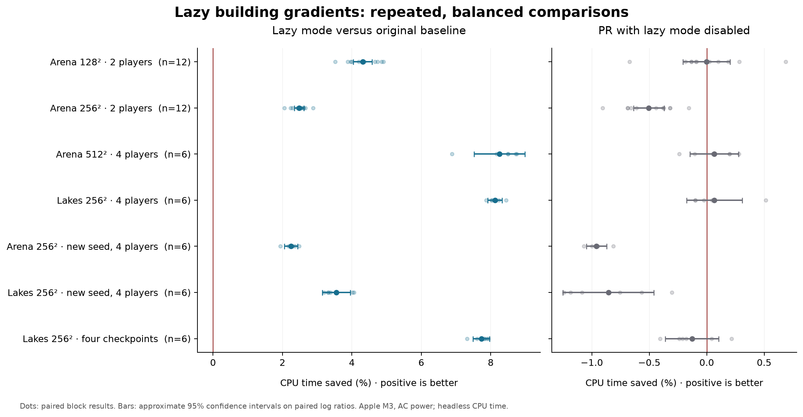

# Lazy building gradients: controlled timing study

The simple lazy implementation is a repeatable CPU improvement on every tested workload. It saves about 2–8% of total headless process CPU versus the original baseline. The larger building-heavy games benefit most. Keeping the PR's lazy mode disabled has a small cost in some cases, so lazy-versus-eager alone slightly overstates the net benefit.

These results supersede the earlier two-run timing estimates, including the apparent 256² slowdown. They do not establish the cause of that earlier variability. The original measurements remain available in the parent evidence directory.

Implementation: [d50968d06](https://github.com/Globulation2/glob2/commit/d50968d06125dc10fbf4b247e35d0526fe69af0b). Original baseline: [1c49596f5](https://github.com/Globulation2/glob2/commit/1c49596f5195188e7f078768f610454f7068d7c6). No game code changed for this study.

## Total CPU effect

Positive percentages mean less CPU time. Brackets are approximate pointwise 95% confidence intervals. Each repetition is a matched block containing all three variants.

| Workload | Repeats per variant | PR disabled vs baseline | Lazy vs PR disabled | Net lazy vs baseline |
| --- | ---: | ---: | ---: | ---: |
| Arena 128², 2 players | 12 | -0.00% [-0.21, +0.20] | +4.31% [+4.00, +4.63] | **+4.31% [+4.04, +4.58]** |
| Arena 256², 2 players | 12 | -0.50% [-0.64, -0.37] | +2.97% [+2.84, +3.10] | **+2.48% [+2.34, +2.62]** |
| Arena 512², 4 players | 6 | +0.06% [-0.15, +0.28] | +8.20% [+7.51, +8.87] | **+8.25% [+7.52, +8.98]** |
| Lakes 256², 4 players | 6 | +0.07% [-0.18, +0.31] | +8.06% [+7.67, +8.45] | **+8.12% [+7.91, +8.33]** |
| Arena 256², additional seed, 4 players | 6 | -0.96% [-1.05, -0.87] | +3.17% [+2.92, +3.43] | **+2.25% [+2.05, +2.44]** |
| Lakes 256², additional seed, 4 players | 6 | -0.86% [-1.25, -0.46] | +4.37% [+4.20, +4.54] | **+3.55% [+3.15, +3.95]** |
| Lakes 256², four checkpoints | 6 | -0.13% [-0.36, +0.11] | +7.85% [+7.59, +8.11] | **+7.73% [+7.49, +7.97]** |



“PR disabled” includes all integration/refactoring overhead with lazy mode off; it does not isolate the shared expansion kernel. The within-PR comparison uses exactly the same executable for both modes. There is no single representative aggregate percentage: the cases have different sizes, durations and building workloads.

## Absolute costs and memory

CPU values below are arithmetic means in seconds. Memory is the difference between means of per-process peak RSS, not a precise measurement of allocated cache memory. The effect estimates above use paired geometric ratios, so they need not equal ratios of these rounded arithmetic means.

| Workload | Baseline CPU s | PR disabled CPU s | Lazy CPU s | Extra lazy RSS vs PR disabled MiB | Extra lazy RSS vs baseline MiB |
| --- | ---: | ---: | ---: | ---: | ---: |
| Arena 128², 2 players | 3.117 | 3.117 | 2.983 | +0.37 | +0.42 |
| Arena 256², 2 players | 9.282 | 9.329 | 9.052 | +0.64 | +0.86 |
| Arena 512², 4 players | 46.493 | 46.463 | 42.656 | +6.45 | +5.48 |
| Lakes 256², 4 players | 15.292 | 15.282 | 14.051 | +3.34 | +3.72 |
| Arena 256², additional seed, 4 players | 5.049 | 5.097 | 4.936 | +0.46 | +0.31 |
| Lakes 256², additional seed, 4 players | 6.553 | 6.609 | 6.320 | +1.25 | +1.45 |
| Lakes 256², four checkpoints | 15.515 | 15.535 | 14.316 | +3.52 | +3.74 |

## Where the time goes

These are elapsed-time instrumentation scopes, not process CPU counters. Building time sums `gradient.building` and `gradient.building_resume`; this includes initialization, seed scanning and resumed expansion. Initialization and seed scanning remain eager. The study does not separately measure their costs or estimate hypothetical designs that eliminate them. Resource gradients are unchanged and shown as context. Inclusive scopes must not be summed into a total CPU budget.

| Workload | Building seconds: PR disabled → lazy | Reduction in building scope | Resource seconds: PR disabled → lazy |
| --- | ---: | ---: | ---: |
| Arena 128², 2 players | 0.394 → 0.269 | 31.7% | 1.114 → 1.106 |
| Arena 256², 2 players | 0.827 → 0.557 | 32.6% | 4.432 → 4.425 |
| Arena 512², 4 players | 9.940 → 6.038 | 39.2% | 17.791 → 17.826 |
| Lakes 256², 4 players | 3.608 → 2.354 | 34.7% | 4.196 → 4.214 |
| Arena 256², additional seed, 4 players | 0.494 → 0.348 | 29.5% | 2.129 → 2.122 |
| Lakes 256², additional seed, 4 players | 0.921 → 0.627 | 31.9% | 2.382 → 2.382 |
| Lakes 256², four checkpoints | 3.590 → 2.371 | 33.9% | 4.174 → 4.172 |

## Saving and latency

The checkpoint workload performs four synchronous headless saves, one every 4,096 ticks. Across six repeats per variant, mean `save.serialize` elapsed time rises from **92.8 ms to 105.4 ms**. The paired increase is **12.6 ms per save**, with a 95% interval of **3.4–21.8 ms**. The largest observed serialization scope is 130.5 ms with lazy disabled and 150.9 ms with lazy enabled. Despite this cost, the whole checkpoint run still saves **7.7%** CPU versus baseline.

Serialization finishes pending fields. These headless saves include synchronous hashing/writing work; GUI asynchronous autosave has a different I/O path. This measures a real save-related cost, but is not a prediction of GUI autosave frame stalls. Storage/cache effects remain in these measurements.

Per-run maximum `loop.work` scopes were also retained in `analysis.json`. A handful of maxima is not a reliable frame-latency distribution, and no interactive FPS or p95/p99 frame claims are made.

## Fixed protocol and uncertainty

- **162 measured runs in 54 matched blocks**, plus three excluded warmups. Twelve repeats per variant for each two-player arena; six for each other scenario.
- Each block runs original baseline, PR disabled and PR lazy back-to-back. All six variant permutations occur exactly once per six repeats. Case order is shuffled each round with fixed scheduling seed 20260928. The full plan was fixed before measurements; no runs were dropped or added based on their performance.
- Apple M3, 24 GiB, macOS arm64, release builds with Apple clang 21.0.0. The exact binaries and fixtures are SHA-256 identified in `plan.json`; source/compiler metadata is in the parent evidence directory.
- Primary metric is child-process user + system CPU from `wait4`, including startup and shutdown. Wall time, peak RSS, faults, context switches, final performance scopes and game results are retained for every run.
- Every variant uses team-timeline telemetry and normal performance scopes. Renderer and checksum telemetry are off. Saves are off except in the checkpoint case. No compilation or compression ran concurrently with measurements.
- Every trial checks final ticks, termination and team results against its baseline. These coarse outcomes agree in all runs; they do not replace per-tick correctness validation. The parent evidence retains the separate 65,442-tick-per-mode checksum comparisons and the existing Maxima diagnostic save caveat.
- Confidence intervals use a Student-t interval on paired log CPU ratios across blocks, transformed back to percent savings. They estimate repeatability for these fixed games, not variation across all maps, machines or future games. Intervals are pointwise and not adjusted for multiple comparisons; with six or twelve blocks, distributional assumptions remain relevant.
- All measured runs began and ended on AC power. Low-power mode was disabled. Wall/CPU ratios ranged from 1.000 to 1.020; median 1.001. `pmset` reported no recorded thermal/performance warnings. These checks do not establish fixed CPU frequency, core affinity or an otherwise perfectly idle desktop. Earlier battery warmup conditions are retained separately.

## Workloads

| Case / fixture | Generator | Map seed | Game seed | Players | Tick target | Save interval |
| --- | ---: | ---: | ---: | ---: | ---: | ---: |
| arena128-2 | 15 | 42 | 19 | 2 | 16384 | none |
| arena256-2 | 15 | 42 | 19 | 2 | 16384 | none |
| arena512-4 | 15 | 42 | 19 | 4 | 16384 | none |
| lakes256-4 | 4 | 97 | 19 | 4 | 16384 | none |
| arena256-seed73 | 15 | 73 | 31 | 4 | 8192 | none |
| lakes256-seed131 | 4 | 131 | 31 | 4 | 8192 | none |
| lakes256-checkpoints | 4 | 97 | 19 | 4 | 16384 | 4096 |

Two-player games use Nicowar/Warrush. Four-player games add Cortex/Maxima. The arena128 game terminates at tick 16,290. The two additional seeded cases run to 8,192 ticks; they sample different game states as well as different maps. The checkpoint case uses the same map and game seed as lakes256-4. Map generation was outside measured time.

## Assessment

Keep the simple lazy design: the measured total-CPU benefit is modest but repeatable, and building-gradient scopes improve materially. Account for retained memory, extra work at serialization, and the small disabled-mode overhead. There is no evidence here to justify more complex initialization/seed-scanning designs, a universal speedup claim, or default enablement without further review.

The remaining practical coverage gaps are interactive play, GUI autosave/frame latency, longer and more varied games, other CPUs, and full-game cross-platform checksum equivalence. The feature remains opt-in; this study does not change defaults or merge the PR.

## Evidence and reproduction

- `plan.json`: preselected cases, execution order, seeds and hashes.
- `measurements.jsonl`, `warmups.jsonl`: all commands, counters, scopes, environment snapshots and results.
- `analysis.json`, `analyze.py`: derived paired effects, intervals, phase costs, memory and save measurements.
- `study.py`: exact original local driver; its absolute paths describe the original run.
- `reproduce.py`: portable fixture-based runner using explicit executable paths; `fixtures/` contains all seven maps.
- `raw-*.tar.gz`: original logs and result JSON, grouped by case. Redundant checkpoint game files stay local; prior correctness saves are retained in the parent evidence archives.
- `manifest.json`: SHA-256 hashes for published evidence files. `completed.json` and `driver.log` record completion.

Build baseline and implementation in separate source checkouts using the same compiler and release settings. From the implementation source checkout, with repository assets available:

```sh
CCACHE=1 scons -j6 release=1 server=0 build/darwin/client/release/src/glob2
python3 /path/to/evidence/timing-study/reproduce.py --base-binary /path/to/baseline/glob2 --pr-binary /path/to/implementation/glob2 --output artifacts/timing-reproduction
```

Use the corresponding native build target on another platform. Reproduction requires a POSIX host (`wait4`); the runner accounts for macOS/Linux RSS units. It does not set CPU affinity or power policy. Use a fresh output directory, stable power and no competing heavy work. Copy `analyze.py` beside the new `plan.json`/`measurements.jsonl` to analyze a reproduction. `--case` selects a single recorded scenario. The portable runner is syntax/help checked; the original `study.py` is the driver used for all reported measurements.
